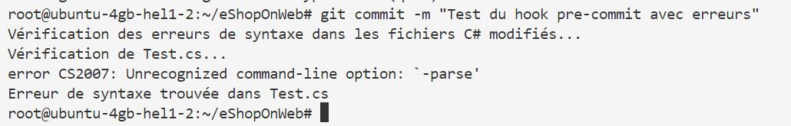

## Introduction
Dans ce TP avancé, nous allons explorer les concepts avancés de la gestion des sources avec Git. Nous allons apprendre à installer Git, créer un fork d'un dépôt, configurer l'authentification, gérer les versions de notre code, créer des branches, effectuer des commits, résoudre des conflits, utiliser des tags, stasher des modifications, et collaborer avec d'autres développeurs à l'aide de pull requests.

## Prérequis
- Un compte GitHub ou GitLab.
- Le projet eShopOnWeb cloné depuis GitHub.

## Étapes du TP

### Étape 1 : Installation de Git

#### Sur Windows
1. Téléchargez l'installateur de Git depuis [git-scm.com](https://git-scm.com/download/win).
2. Exécutez l'installateur et suivez les instructions à l'écran.

#### Sur macOS
1. Ouvrez le terminal et installez Git avec Homebrew :
   ```bash
   brew install git
   ```

#### Sur Linux (Debian/Ubuntu)
1. Ouvrez le terminal et installez Git avec apt :
   ```bash
   sudo apt update
   sudo apt install git
   ```

### Étape 2 : Configuration initiale
1. **Configurer Git avec votre nom et email :**
   ```bash
   git config --global user.name "Votre Nom"
   git config --global user.email "votre.email@example.com"
   ```

### Étape 3 : Créer un Fork
1. **Créer un fork du dépôt eShopOnWeb sur GitHub :**
   - Allez sur la page du dépôt eShopOnWeb sur GitHub.
   - Cliquez sur le bouton "Fork" en haut à droite de la page.
   - Sélectionnez votre compte pour créer le fork.

2. **Cloner votre fork localement :**
   ```bash
   git clone https://github.com/votre-utilisateur/eShopOnWeb.git
   cd eShopOnWeb
   ```

### Étape 4 : Authentification
1. **Configurer l'authentification SSH :**
   - Générez une clé SSH :
     ```bash
     ssh-keygen -t ed25519 -C "votre.email@example.com"
     ```
   - Ajoutez la clé SSH à votre compte GitHub ou GitLab :

     #### Pour GitHub :
     - Allez sur GitHub et connectez-vous à votre compte.
     - Cliquez sur votre photo de profil dans le coin supérieur droit, puis sur "Settings".
     
     - Dans le menu de gauche, cliquez sur "SSH and GPG keys".
     
     - Cliquez sur le bouton "New SSH key".
     - Donnez un titre à votre clé (par exemple, "Mon ordinateur personnel").
     - Collez votre clé SSH dans le champ "Key".
     - Cliquez sur "Add SSH key".
     
     - Changer l'URL du dépôt distant pour utiliser SSH:
     ```bash
     git remote set-url origin git@github.com:<votre-utilisateur/eShopOnWeb.git
     ```
     - Vérifier que l'URL du dépôt distant a été changé
     ```bash
     git remote -v
     ```
     
     #### Pour GitLab :
     - Allez sur GithLab et connectez-vous à votre compte.
     - Cliquez sur votre photo de profil dans le coin supérieur droit, puis sur "Preferences".
     - Dans le menu de gauche, cliquez sur "SSH Keys".
     - Collez votre clé SSH dans le champ "Key".
     - Donnez un titre à votre clé (par exemple, "Mon ordinateur personnel").
     - Cliquez sur "Add key".
     ```

### Étape 5 : Création et gestion des branches
1. **Créer une nouvelle branche :**
   ```bash
   git branch ma-nouvelle-fonctionnalite
   ```

2. **Basculer sur la nouvelle branche :**
   ```bash
   git checkout ma-nouvelle-fonctionnalite
   ```

3. **Vérifier les branches existantes :**
   ```bash
   git branch
   ```

### Étape 6 : Effectuer des commits
1. **Apporter des modifications au code :**
   - Ouvrez le fichier README.md du projet dans un éditeur de texte et effectuez des modifications: ajouter un commentaire par exemple

2. **Ajouter les modifications à l'index :**
   ```bash
   git add .
   ```

3. **Effectuer un commit :**
   ```bash
   git commit -m "Ajout d'une nouvelle fonctionnalité"
   ```

### Étape 7 : Fusionner les branches et résoudre les conflits
1. **Basculer sur la branche principale :**
   ```bash
   git checkout main
   ```

2. **Créer une autre branche avec des modifications conflictuelles :**
   ```bash
   git branch une-autre-fonctionnalite
   git checkout une-autre-fonctionnalite
   ```
   - Modifiez le même fichier que dans `ma-nouvelle-fonctionnalite` pour créer un conflit.

3. **Fusionner la branche dans la branche principale :**
   ```bash
   git merge ma-nouvelle-fonctionnalite
   ```

4. **Résoudre les conflits :**
   - Ouvrez le fichier avec des conflits, résolvez-les, puis effectuez un commit :
   ```bash
   git add .
   git commit -m "Résolution des conflits"
   ```

### Étape 8 : Rebase vs Merge
1. **Basculer sur la branche `ma-nouvelle-fonctionnalite` :**
   ```bash
   git checkout ma-nouvelle-fonctionnalite
   ```

2. **Utiliser `git rebase` pour intégrer les modifications de `main` :**
   ```bash
   git rebase main
   ```

### Étape 9 : Utilisation des tags
1. **Créer un tag pour une version :**
   ```bash
   git tag -a v1.0 -m "Version 1.0"
   ```

2. **Vérifier les tags existants :**
   ```bash
   git tag
   ```

3. **Pousser les tags vers le dépôt distant :**
   ```bash
   git push origin v1.0
   ```

### Étape 10 : Stashing des modifications
1. **Apporter des modifications sans les commiter :**
   - Modifiez un fichier.

2. **Stasher les modifications :**
   ```bash
   git stash
   ```

3. **Récupérer les modifications stashées :**
   ```bash
   git stash pop
   ```

### Étape 11 : Revert et Reset
1. **Utiliser `git revert` pour annuler un commit :**
   ```bash
   git log
   git revert -m 1 <commit-hash>
   ```

2. **Utiliser `git reset` pour annuler des modifications :**
   ```bash
   git log 
   git reset --hard <commit-hash>
   ```
   

### Étape 12 : Collaboration avec des pull requests
1. **Basculer sur la branche `ma-nouvelle-fonctionnalite` :**
   ```bash
   git checkout ma-nouvelle-fonctionnalite
   ```

2. **Apporter des modifications au code :**
   - Ouvrez le fichier README.md du projet dans un éditeur de texte et effectuez des modifications: ajouter un commentaire par exemple : # Nouvelle fonctionnalité ajoutée

3. **Ajouter les modifications à l'index :**
   ```bash
   git add .
   ```

4. **Effectuer un commit :**
   ```bash
   git commit -m "Ajout d'une nouvelle fonctionnalité"
   ```
5. **Pousser la branche vers le dépôt distant :**
   ```bash
   git push origin ma-nouvelle-fonctionnalite
   ```
   

6. **Créer une pull request :**
   - Allez sur la page de votre dépôt sur GitHub ou GitLab.
   - Cliquez sur "Pull Requests" puis sur "New Pull Request".
   - Sélectionnez la branche `ma-nouvelle-fonctionnalite` et la branche `main`.
   - Ajoutez une description et cliquez sur "Create Pull Request".
   

   
7. **Revoir et fusionner une pull request :**
   - Allez dans l'onglet "Pull Requests".
   
   - Sélectionnez votre pull request.
   - Passez en revue les modifications.
   
   - Cliquez sur "Merge Pull Request" pour fusionner les modifications dans la branche principale.

### Étape 13 : Utilisation de Git Hooks

1. **Créer un hook pre-commit :**
   - Naviguez vers le dossier `.git/hooks` de votre dépôt :
     ```bash
     cd /chemin/vers/votre/depot/.git/hooks
     ```
   - Créez un fichier nommé `pre-commit` :
     ```bash
     touch pre-commit
     ```
   - Rendez le fichier exécutable :
     ```bash
     chmod +x pre-commit
     ```

2. **Ajouter un script pour vérifier les erreurs de syntaxe :**
   - Ouvrez le fichier `pre-commit` dans un éditeur de texte :
     ```bash
     nano pre-commit
     ```
   - Ajoutez le script suivant pour vérifier les erreurs de syntaxe dans les fichiers C# :

     ```bash
     #!/bin/sh

        # Ce script vérifie les erreurs de syntaxe dans les fichiers C# avant chaque commit.

        # Récupérer la liste des fichiers C# modifiés
        CSHARP_FILES=$(git diff --cached --name-only --diff-filter=ACM | grep -E '\.cs$')

        if [ -z "$CSHARP_FILES" ]; then
            echo "Aucun fichier C# modifié."
            exit 0
        fi

        echo "Vérification des erreurs de syntaxe dans les fichiers C# modifiés..."

        # Vérifier les erreurs de syntaxe dans chaque fichier C# modifié
        for file in $CSHARP_FILES; do
            echo "Vérification de $file..."
            # Utiliser le compilateur C# pour vérifier la syntaxe
            mcs -parse "$file"
            if [ $? -ne 0 ]; then
                echo "Erreur de syntaxe trouvée dans $file"
                exit 1
            fi
        done

        echo "Aucune erreur de syntaxe trouvée."
        exit 0
     ```

3. **Explication du script :**
   - Le script commence par récupérer la liste des fichiers C# modifiés qui sont dans l'index de Git.
   - Il vérifie ensuite chaque fichier pour les erreurs de syntaxe en utilisant le compilateur C# (`mcs`).
   - Si une erreur de syntaxe est trouvée, le script affiche un message d'erreur et quitte avec un code de sortie non nul, ce qui empêche le commit.
   - Si aucune erreur de syntaxe n'est trouvée, le script affiche un message de succès et quitte avec un code de sortie nul, permettant le commit.


4. **Tester le hook :**
   - Ajouter du code C# avec des erreurs de syntaxe :
     ```bash
     vi Test.cs
     ```
   - Ajoutez le code suivant, qui contient plusieurs erreurs de syntaxe :

     ```csharp
     using System;

     namespace TestApp
     {
         class Program
         {
             static void Main(string[] args)
             {
                 Console.WriteLine("Bonjour, monde!");

                 // Erreur 1: Parentheses manquantes
                 if 5 > 3
                 {
                     Console.WriteLine("C'est vrai!");
                 }

                 // Erreur 2: Point-virgule manquant
                 int x = 5
                 int y = 10

                 // Erreur 3: Mauvais type de donnée
                 string z = x + y;

                 // Erreur 4: Accolade manquante
                 for (int i = 0; i < 5; i++)
                 {
                     Console.WriteLine(i);
                 }

                 // Erreur 5: Mauvais nom de méthode
                 Console.Writeline("Fin du programme");
             }
         }
     }
     ```
   - Ajoutez le fichier Test.cs à l'index de Git :
     ```bash
     git add Test.cs
     ```
   - Installez le compilateur C# mcs:
     ```bash
     sudo apt-get install mono-complete
     ```
   - Essayez de faire un commit :
     ```bash
     git commit -m "Test du hook pre-commit avec erreurs"
     ```
     
   - Si le fichier contient des erreurs de syntaxe, le commit sera bloqué et vous verrez un message d'erreur.
   - Si le fichier ne contient pas d'erreurs de syntaxe, le commit sera effectué normalement.

### Étape 14 : Utilisation de Git Reflog
1. **Utiliser `git reflog` pour voir l'historique des actions :**
   ```bash
   git reflog
   ```

2. **Récupérer un commit perdu :**
   ```bash
   git checkout <commit-hash>
   ```

## Résumé
Dans ce TP avancé, nous avons appris à installer Git, créer un fork d'un dépôt, configurer l'authentification, gérer les versions de notre code, créer des branches, effectuer des commits, résoudre des conflits, utiliser des tags, stasher des modifications, et collaborer avec d'autres développeurs à l'aide de pull requests. Ces compétences sont essentielles pour travailler efficacement en équipe et gérer les versions de notre code.

## Annexe
- [Documentation de Git](https://git-scm.com/doc)
- [Documentation de GitHub](https://docs.github.com/)
- [Documentation de GitLab](https://docs.gitlab.com/)

---


Ce TP détaillé devrait vous permettre de comprendre et de mettre en pratique les concepts avancés de la gestion des sources avec Git. Si vous avez des questions ou rencontrez des problèmes, n'hésitez pas à demander de l'aide !
