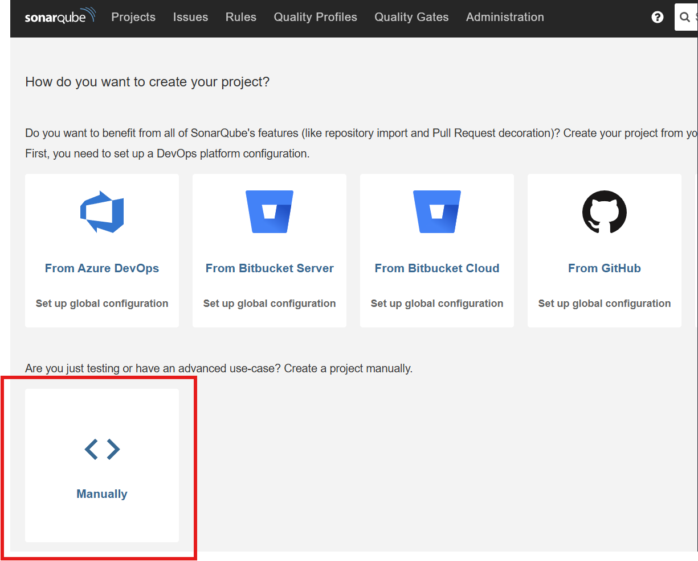

## **Labs Complet : Analyse de Qualité avec SonarQube sur eShopOnWeb**

### **Partie 1 : Installation de Docker et Docker Compose**

**Durée estimée :** 15-20 minutes

**Tâches :**

1. **Installation de Docker :**

**Sur Windows :**
```bash
# Télécharger Docker Desktop depuis https://www.docker.com/products/docker-desktop/
# L'installation inclut Docker Compose par défaut
# Après installation, redémarrer et vérifier :
docker --version
docker-compose --version
```

**Sur Linux (Ubuntu/Debian) :**
```bash
# 1. Mettre à jour les paquets
sudo apt update

# 2. Installer Docker
sudo apt install docker.io

# 3. Démarrer et activer Docker
sudo systemctl start docker
sudo systemctl enable docker

# 4. Ajouter l'utilisateur au groupe docker
sudo usermod -aG docker $USER

# 5. Installer Docker Compose
sudo apt install docker-compose

# 6. Redémarrer la session
# Nouvelle session terminal ou : newgrp docker

# 7. Vérifier les installations
docker --version
docker-compose --version
```

**Sur macOS :**
```bash
# Installer Docker Desktop depuis https://www.docker.com/products/docker-desktop/
# Ou via Homebrew :
brew install --cask docker
# Docker Compose est inclus dans Docker Desktop
```

2. **Vérification de l'installation :**
```bash
# Tester Docker
docker run hello-world

# Tester Docker Compose
docker-compose --version

# Vérifier que tout fonctionne
docker ps
```

### **Partie 2 : Déploiement de SonarQube avec Docker Compose**

**Durée estimée :** 20-25 minutes

**Tâches :**

1. **Créer un répertoire pour le projet :**
```bash
mkdir sonar-eshop-analysis
cd sonar-eshop-analysis
```

2. **Créer le fichier docker-compose.yml :**
```yaml
version: '3.8'

services:
  sonarqube:
    image: sonarqube:lts-community
    container_name: sonarqube
    hostname: sonarqube
    depends_on:
      - postgresql
    environment:
      - SONAR_JDBC_URL=jdbc:postgresql://postgresql:5432/sonar
      - SONAR_JDBC_USERNAME=sonar
      - SONAR_JDBC_PASSWORD=sonar
      - SONAR_ES_BOOTSTRAP_CHECKS_DISABLE=true
    volumes:
      - sonarqube_data:/opt/sonarqube/data
      - sonarqube_extensions:/opt/sonarqube/extensions
      - sonarqube_logs:/opt/sonarqube/logs
    ports:
      - "9000:9000"
    networks:
      - sonarnet

  postgresql:
    image: postgres:13
    container_name: postgresql
    hostname: postgresql
    environment:
      - POSTGRES_USER=sonar
      - POSTGRES_PASSWORD=sonar
      - POSTGRES_DB=sonar
    volumes:
      - postgresql_data:/var/lib/postgresql/data
      - postgresql_logs:/var/log/postgresql
    networks:
      - sonarnet

volumes:
  sonarqube_data:
  sonarqube_extensions:
  sonarqube_logs:
  postgresql_data:
  postgresql_logs:

networks:
  sonarnet:
    driver: bridge
```

3. **Démarrer l'infrastructure SonarQube :**
```bash
# Démarrer les services en arrière-plan
docker-compose up -d

# Vérifier l'état des conteneurs
docker-compose ps

# Vérifier les logs de démarrage
docker-compose logs -f sonarqube

# Attendre que SonarQube soit complètement démarré (2-3 minutes)
# Le message "SonarQube is up" doit apparaître dans les logs
```
ssh -L 9000:localhost:9000 nom_utilisateur@adresse_ip_de_la_vm
4. **Accéder et configurer SonarQube :**
- Ouvrez votre navigateur : **http://localhost:9000**
- Identifiez-vous avec :
  - Login : `admin`
  - Mot de passe : `admin`
- Changez le mot de passe : `admin123`

- Créez un nouveau projet :

  - **Nom** : "eShopOnWeb Analysis"
  - **Clé** : `eshoponweb-analysis`


4. **Génération du token**

- Choisissez la méthode : "Locally"
- Token name : `eshop-token-2024`
- Expiration : Gardez "No expiration" (ou choisissez 30 jours pour plus de sécurité)

- Cliquez sur **"Generate"**  (notez-le précieusement !)
 

5. **Configuration de l'analyse .NET**
- Sur l'interface SonarQube, cliquez sur ".NET" puisque eShopOnWeb est un projet C#/.NET.
### **Partie 3 : Récupération et Préparation du Projet eShopOnWeb**

**Durée estimée :** 15-20 minutes

**Tâches :**

1. **Cloner le repository :**
```bash
# Se placer dans le répertoire du projet
cd sonar-eshop-analysis

# Cloner le projet eShopOnWeb
git clone https://github.com/MicrosoftLearning/eShopOnWeb.git

# Explorer la structure
cd eShopOnWeb
ls -la
```

2. **Analyser la structure du projet :**
```bash
# Voir les solutions .NET
find . -name "*.sln" -type f

# Voir les projets C#
find . -name "*.csproj" -type f | head -10

# Structure principale
tree -L 3 src/ | head -20
```

3. **Vérifier l'environnement .NET :**
```bash
# Vérifier la version de .NET
dotnet --version

# Si .NET n'est pas installé :
# Windows : https://dotnet.microsoft.com/download/dotnet/6.0
# Linux : 
wget https://packages.microsoft.com/config/ubuntu/$(lsb_release -rs)/packages-microsoft-prod.deb -O packages-microsoft-prod.deb
sudo dpkg -i packages-microsoft-prod.deb
rm packages-microsoft-prod.deb

sudo apt-get update
sudo apt-get install -y apt-transport-https
sudo apt-get update
sudo apt-get install -y dotnet-sdk-8.0

# sudo apt install dotnet-sdk-6.0
# macOS : brew install dotnet

# Lister les SDK installés
dotnet --list-sdks
```

### **Partie 4 : Configuration de l'Analyse SonarQube**

**Durée estimée :** 25-30 minutes

**Tâches :**

1. **Installer les outils nécessaires :**
```bash
# Installer le scanner SonarQube pour .NET
dotnet tool install --global dotnet-sonarscanner

# Installer coverlet pour la couverture de code
dotnet tool install --global coverlet.console

# Vérifier l'installation
dotnet sonarscanner --version
# Mettre à jour les paquets
apt update

# Installer Java (OpenJDK 11 ou 17)
apt install -y openjdk-11-jre

# Ou pour Java 17
apt install -y openjdk-17-jre

# Vérifier l'installation
java -version
which java
```

2. **Créer les scripts d'analyse :**

**Script Linux/Mac (`analyse-sonar.sh`) :**
```bash
# S'assurer d'être dans le bon répertoire
cd ~/eShopOnWeb

# Tester chaque étape manuellement
echo "=== TEST MANUEL ==="

# Étape 1: Démarrer l'analyse
echo "1. Démarrage analyse..."
dotnet-sonarscanner begin /k:"eshoponweb-analysis" /d:sonar.host.url="http://localhost:9000" /d:sonar.login="votre-token"

# Étape 2: Build
echo "2. Build..."
dotnet build eShopOnWeb.sln

# Étape 3: Finaliser
echo "3. Finalisation..."
dotnet-sonarscanner end /d:sonar.login="votre-token"

echo "=== TEST TERMINÉ ==="
```

3. **Exécuter l'analyse :**
```bash
# Rendre le script exécutable (Linux/Mac)
chmod +x analyse-sonar.sh

# Exécuter l'analyse
./analyse-sonar.sh

# Ou pour Windows
.\analyse-sonar.ps1
```


### **Partie 5 : Analyse des Résultats et Génération de Rapports**

**Durée estimée :** 20-30 minutes

**Tâches :**

1. **Analyser le rapport SonarQube :**
- Accédez à **http://localhost:9000**
- Cliquez sur le projet "eShopOnWeb Analysis"
- Explorez les différentes sections

2. **Répondre au questionnaire d'analyse :**

**A. Métriques de Base :**
```
1. Qualité globale du projet :
   - Fiabilité : ___/A
   - Sécurité : ___/A  
   - Maintenabilité : ___/A

2. Volume de code :
   - Lignes de code : ______
   - Fichiers analysés : ______

3. Dette technique :
   - Dette totale : ______
   - Pourcentage : ___%
```

**B. Qualité du Code :**
```
4. Problèmes identifiés :
   - Bugs : ______
   - Vulnérabilités : ______
   - Code Smells : ______

5. Couverture de code :
   - Pourcentage de couverture : ___%
   - Lignes à couvrir : ______

6. Duplication :
   - Blocs dupliqués : ______
   - Fichiers dupliqués : ______
```

**C. Analyse Détaillée :**
```
7. Top 3 des règles les plus violées :
   - 1. ______________________
   - 2. ______________________
   - 3. ______________________

8. Recommandations d'amélioration :
   - 1. ______________________
   - 2. ______________________
   - 3. ______________________
```

3. **Générer un rapport de build :**
```bash
# Build détaillé avec journal
dotnet build eShopOnWeb.sln --configuration Release --verbosity normal > build-report.txt

# Voir le résumé
echo "=== RÉSUMÉ DU BUILD ==="
grep -E "(SUCCÈS|ÉCHEC|avertissement|erreur)" build-report.txt | tail -10

# Vérifier les tests
find . -name "*.trx" -type f | head -5
```

### **Partie 6 : Nettoyage et Documentation**

**Durée estimée :** 10 minutes

**Tâches :**

1. **Documenter les résultats :**
```bash
# Créer un rapport final
cat > rapport-analysis.txt << EOF
RAPPORT D'ANALYSE SONARQUBE - eShopOnWeb
==========================================
Date: $(date)
Projet: eShopOnWeb
Analyseur: SonarQube

RÉSULTATS PRINCIPAUX:
- Qualité globale: [Note A-E]
- Couverture tests: [X]%
- Dette technique: [X] jours

PROBLÈMES IDENTIFIÉS:
- Bugs: [X]
- Vulnérabilités: [X] 
- Code Smells: [X]

RECOMMANDATIONS:
1. [Première recommandation]
2. [Deuxième recommandation]
3. [Troisième recommandation]
EOF
```

2. **Arrêter l'infrastructure :**
```bash
# Revenir au répertoire principal
cd ..

# Arrêter les conteneurs
docker-compose down

# Vérifier l'arrêt
docker-compose ps

# Supprimer les volumes (optionnel - attention données perdues)
# docker-compose down -v
```

### **Dépannage Courant**

1. **SonarQube ne démarre pas :**
```bash
# Vérifier la mémoire
docker stats

# Voir les logs détaillés
docker-compose logs sonarqube

# Redémarrer
docker-compose restart sonarqube
```

2. **Problèmes de build .NET :**
```bash
# Nettoyer la solution
dotnet clean
dotnet restore

# Vérifier la compatibilité .NET
dotnet --list-sdks
```

3. **Problèmes de token :**
- Vérifiez le token dans SonarQube > Administration > Security > Users
- Régénérez si nécessaire

### **Critères de Validation**

- [ ] Docker et Docker Compose installés et fonctionnels
- [ ] SonarQube accessible sur localhost:9000
- [ ] Projet eShopOnWeb cloné et compilé
- [ ] Analyse SonarQube exécutée avec succès
- [ ] Rapport SonarQube disponible et analysé
- [ ] Questionnaire d'analyse complété
- [ ] Rapport de build généré

**Temps total estimé du labs : 2-3 heures**


Ce labs complet vous guide à travers toutes les étapes, de l'installation des outils à l'analyse détaillée des résultats. Bonne analyse !

