# Labs GitHub Actions - Version Interface Moderne

## Objectif du Labs
Maîtriser GitHub Actions en utilisant uniquement l'interface web de GitHub, sans commandes en terminal.

---

## Partie 1 : Configuration Initiale

### Exercice 1.1 : Création du Repository
**Durée** : 5 minutes

**Instructions** :
1. Aller sur [github.com](https://github.com)
2. Cliquer sur **"+"** en haut à droite → **"New repository"**
3. Remplir :
   - Repository name : `github-actions-labs`
   - Description : "Labs pour apprendre GitHub Actions"
   - Cocher **"Add a README file"**
4. Cliquer **"Create repository"**

✅ **Validation** : Repository créé avec page README affichée

---

## Partie 2 : Premier Workflow

### Exercice 2.1 : Workflow "Hello World"
**Durée** : 15 minutes

**Instructions** :
1. Dans votre repository, cliquer sur l'onglet **"Actions"**
2. Cliquer sur **"Configure"** dans la carte "Simple workflow"
3. Modifier le nom :
   ```yaml
   name: Premier Workflow
   ```
4. **Commit** :
   - Cliquer **"Start commit"**
   - Message : "Ajout premier workflow"
   - Choisir **"Commit directly to the main branch"**
   - Cliquer **"Commit new file"**

**Observation** :
- Retourner dans **"Actions"**
- Voir le workflow s'exécuter automatiquement
- Cliquer sur le workflow pour voir les logs
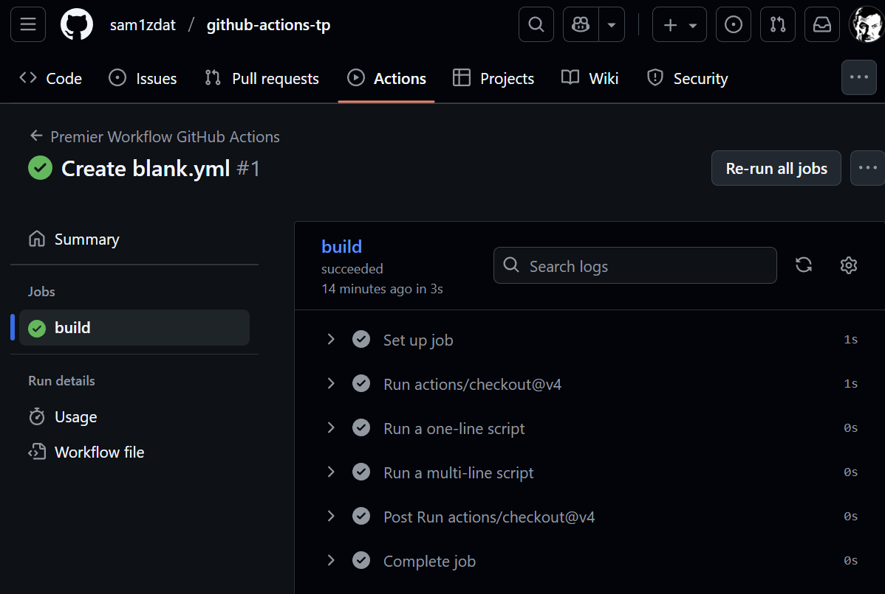
---

## Partie 3 : Navigation et Analyse

### Exercice 3.1 : Explorer l'Interface
**Durée** : 20 minutes

**Instructions** :

1. **Vue d'ensemble** :
   - Onglet **"Actions"** → Vue principale
   - Votre workflow **"Premier Workflow"** apparaît

2. **Détails d'un workflow** :
   - Cliquer sur **"Premier Workflow"**
   - Voir la liste des exécutions
   - Chaque ligne montre : statut, commit, branche, auteur, durée

3. **Analyse d'une exécution** :
   - Cliquer sur **"Premier Workflow #1"**
   - Observer :
     - Diagramme des jobs en haut
     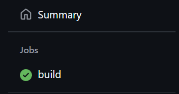
     - Logs détaillés en cliquant sur chaque étape
     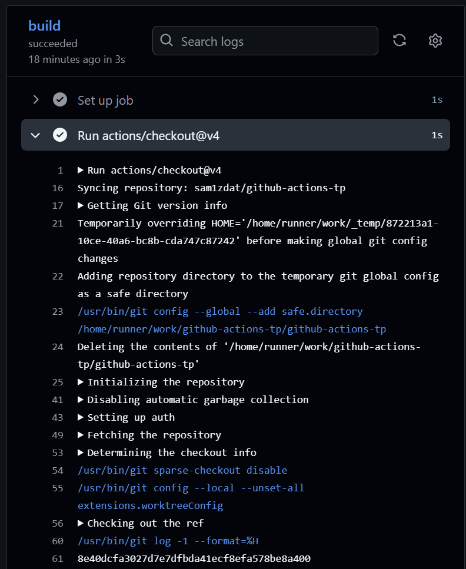
     - Temps d'exécution par étape
     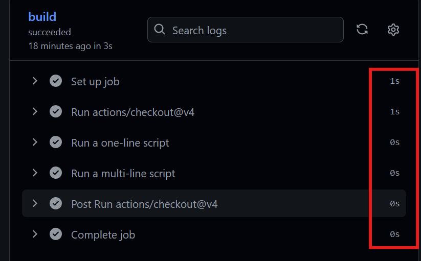
4. **Lancement manuel** :
   - Revenir à la page du workflow
   - Chercher le bouton **"Run workflow"** ▼
   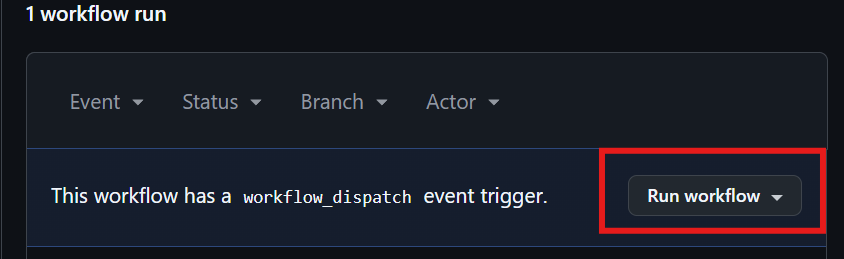
   - Cliquer et exécuter
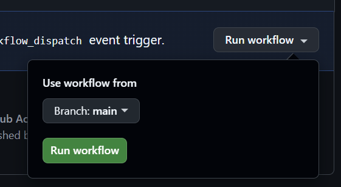
✅ **Validation** : Navigation maîtrisée dans l'interface Actions

---

## Partie 4 : Workflows Avancés

### Exercice 4.1 : Workflow Multi-Jobs
**Durée** : 20 minutes

**Instructions** :
1. **Créer un nouveau workflow** :
   - Onglet **"Actions"** → **"New workflow"**
   - Cliquer **"set up a workflow yourself"**

2. **Nommer** : `multi-jobs.yml`

3. **Contenu** :
   ```yaml
   name: Workflow Multi-Jobs
   
   on:
     workflow_dispatch:
   
   jobs:
     preparation:
       runs-on: ubuntu-latest
       steps:
       - name: Étape 1
         run: echo "Préparation démarrée"
       
       - name: Générer données
         run: echo "Données prêtes" > info.txt
     
     traitement:
       runs-on: ubuntu-latest
       needs: preparation
       steps:
       - name: Récupération
         run: echo "Traitement après préparation"
       
       - name: Finalisation
         run: echo "Workflow terminé avec succès"
   ```

4. **Commit** : "Ajout workflow multi-jobs"

**Test** :
- Exécuter manuellement le workflow
- Observer l'ordre séquentiel dans le diagramme
- Vérifier que "traitement" attend "preparation"
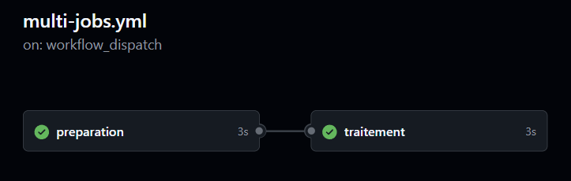
---

## Partie 5 : Matrices et Multi-Environnements

### Exercice 5.1 : Test Multi-OS
**Durée** : 25 minutes

**Instructions** :
1. **Nouveau workflow** : `multi-os.yml`
2. **Contenu** :
   ```yaml
   name: Test Multi-Environnements
   
   on: [workflow_dispatch]
   
   jobs:
     test-compatibilite:
       strategy:
         matrix:
           os: [ubuntu-latest, windows-latest]
           node-version: [18.x, 20.x]
       
       runs-on: ${{ matrix.os }}
       
       steps:
       - name: Informations système
         run: |
           if [ "${{ matrix.os }}" == "ubuntu-latest" ]; then
             echo "🟦 Environnement: Ubuntu"
             echo "Architecture: $(uname -m)"
           else
             Write-Host "🟨 Environnement: Windows"
             Write-Host "Architecture: $env:PROCESSOR_ARCHITECTURE"
           fi
       
       - name: Version Node
         run: echo "Node.js ${{ matrix.node-version }}"
   ```

3. **Commit** : "Test matrices multi-OS"

**Observation** :
- Exécuter le workflow
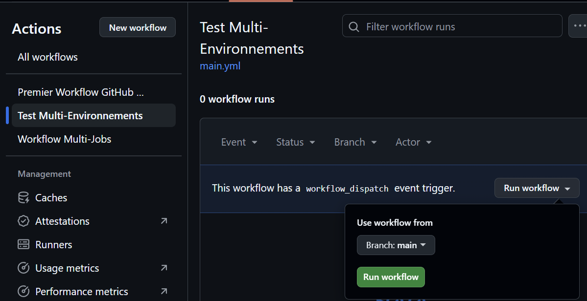
- Voir 4 jobs s'exécuter (2 OS × 2 Node versions)
- Comparer les logs Ubuntu vs Windows
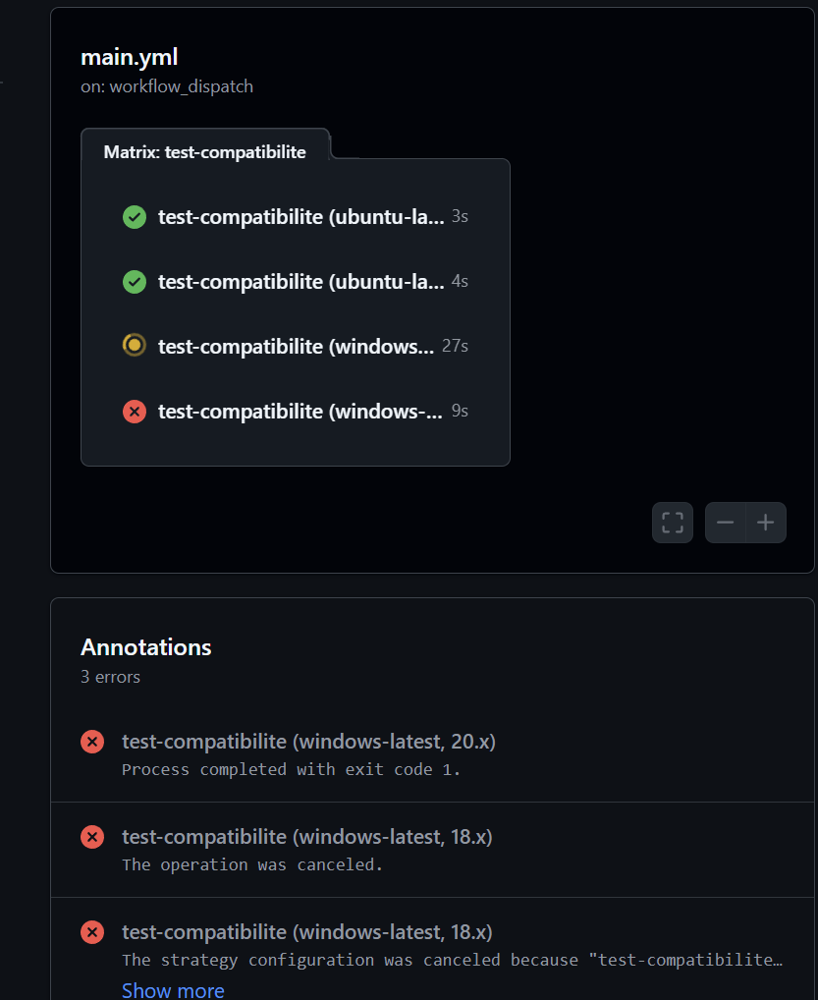
---

## Partie 6 : Gestion des Événements

### Exercice 6.1 : Déclencheurs Avancés
**Durée** : 20 minutes

**Instructions** :
1. **Nouveau workflow** : `declencheurs-avances.yml`
2. **Contenu** :
```yaml
# Workflow: Déclencheurs Avancés
# Description: Ce workflow démontre différents types de déclencheurs GitHub Actions
# Il s'exécute sur divers événements de repository et inclut une planification horaire

name: Déclencheurs Avancés

# Définition des événements qui déclenchent l'exécution du workflow
on:
  # Déclenchement sur les événements d'issues
  issues:
    # Types spécifiques d'événements d'issue à surveiller
    types: [opened, closed]  # Se déclenche à l'ouverture et fermeture d'issues
   
  # Déclenchement sur les événements de pull request
  pull_request:
    # Types spécifiques d'événements de PR à surveiller
    types: [opened, synchronize]  # Se déclenche à l'ouverture et mise à jour de PR
   
  # Déclenchement planifié selon une expression cron
  schedule:
    # Exécution tous les lundis à 10h00
    - cron: '0 10 * * 1'  # Lundi 10h00 (format: minute heure jour-mois mois jour-semaine)

# Définition des jobs à exécuter
jobs:
  # Job: Journalisation des événements
  # Objectif: Logger les informations contextuelles sur l'événement déclencheur
  log-evenement:
    # Environnement d'exécution: dernière version d'Ubuntu
    runs-on: ubuntu-latest
    
    # Étapes séquentielles du job
    steps:
    # Étape: Affichage des informations d'événement
    - name: Afficher infos
      run: |
        # Affiche le type d'événement GitHub qui a déclenché le workflow
        echo "Événement: ${{ github.event_name }}"
        
        # Affiche l'action spécifique au sein de l'événement
        echo "Action: ${{ github.event.action }}"
        
        # Affiche l'utilisateur qui a initié l'événement
        echo "Déclenché par: ${{ github.actor }}"
``` 

3. **Commit** : "Workflow déclencheurs avancés"
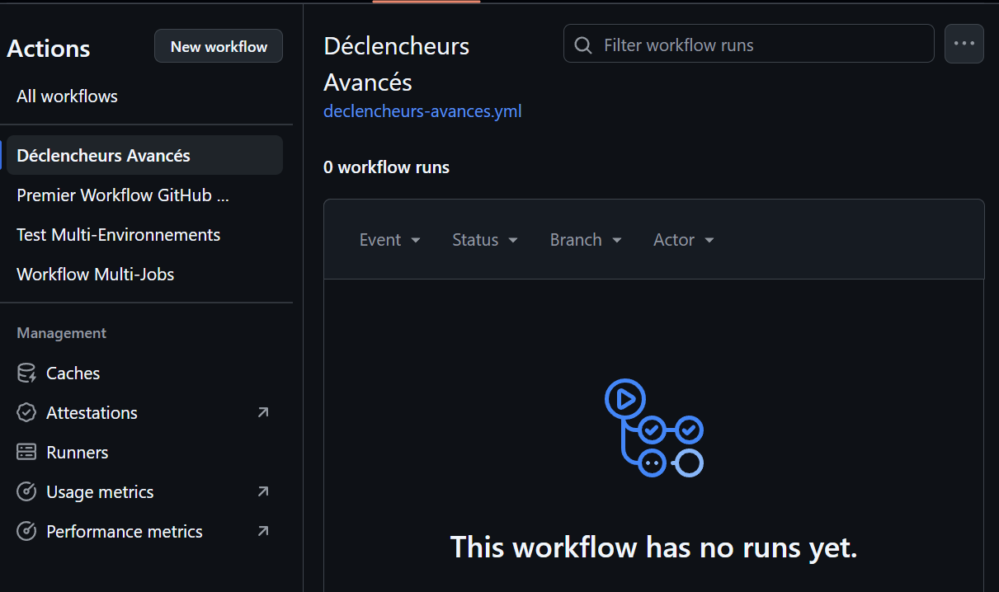
**Tests pratiques** :
1. **Créer une issue** :
   - Onglet **"Issues"** → **"New issue"**
   - Titre : "Test workflow événements"
   - Cliquer **"Submit new issue"**
   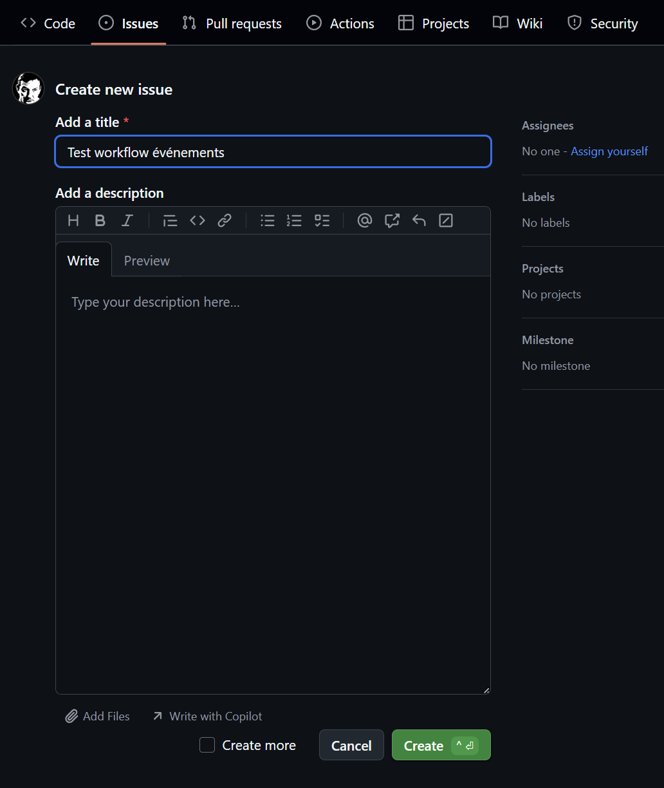
2. **Vérifier** dans **"Actions"** que le workflow s'est déclenché
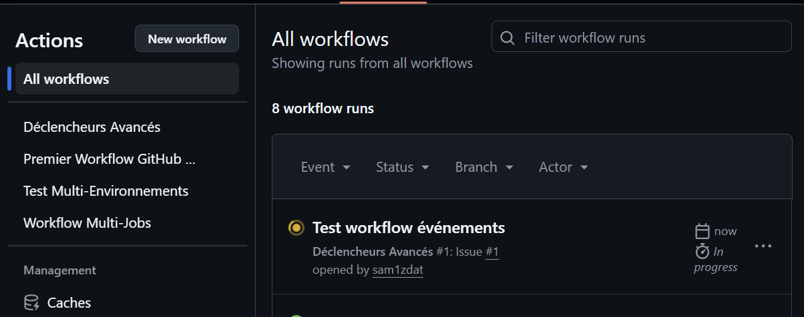
---

## Partie 7 : Sécrets et Sécurité

### Exercice 7.1 : Configuration des Secrets
**Durée** : 15 minutes

**Instructions** :
1. **Ajouter un secret** :
   - Aller dans **"Settings"** du repository
   - **"Secrets and variables"** → **"Actions"**
   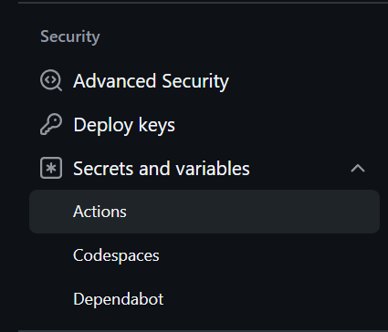
   - **"New repository secret"**
   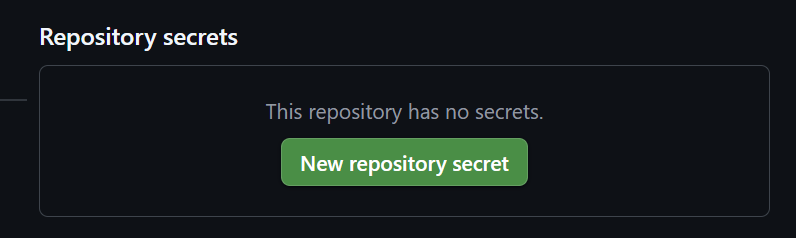
   - Name : `SECRET_DEMO`
   - Value : `mon-secret-super-important`
   - **"Add secret"**

2. **Workflow de test** : `test-secrets.yml`
```yaml
# Workflow: Test Sécurité Secrets
# Description: Ce workflow démontre les bonnes pratiques de gestion des secrets dans GitHub Actions
# Il montre comment utiliser les secrets de manière sécurisée sans les exposer dans les logs

name: Test Sécurité Secrets

# Déclenchement manuel uniquement pour plus de sécurité
# workflow_dispatch permet un déclenchement manuel depuis l'interface GitHub
# Ceci évite l'exécution automatique qui pourrait exposer des secrets
on: [workflow_dispatch]

# Définition des jobs à exécuter
jobs:
  # Job: Démonstration d'utilisation sécurisée des secrets
  # Objectif: Montrer comment manipuler les secrets sans les logger
  utilisation-securisee:
    # Environnement d'exécution sécurisé
    runs-on: ubuntu-latest
    
    # Étapes du job
    steps:
    # Étape: Démonstration des bonnes pratiques pour les secrets
    - name: Bonne pratique
      run: |
        # NE JAMAIS faire: echo "Secret: $SECRET_DEMO" - cela exposerait le secret dans les logs
        # Bonne pratique: Utiliser le secret sans l'afficher directement
        
        # Message de confirmation sans révéler le contenu du secret
        echo "Secret configuré avec succès"
        
        # Afficher uniquement la longueur pour vérification, pas le contenu
        # Ceci est utile pour debugger sans compromettre la sécurité
        echo "Longueur du secret: ${#SECRET_DEMO} caractères"
        
        # Exemple d'utilisation sécurisée dans un script:
        # if [ ${#SECRET_DEMO} -eq 0 ]; then
        #   echo "Erreur: Secret non configuré"
        #   exit 1
        # fi
      env:
        # Définition de la variable d'environnement à partir du secret GitHub
        # IMPORTANT: Le secret doit être configuré dans les paramètres du repository/organisation
        # Bonne pratique: Utiliser des noms significatifs pour les variables d'environnement
        SECRET_DEMO: ${{ secrets.SECRET_DEMO }}

# Bonnes pratiques supplémentaires recommandées:
# 1. Utiliser des secrets d'environnement pour les environnements de production
# 2. Limiter les permissions du token GitHub (GITHUB_TOKEN)
# 3. Auditer régulièrement l'utilisation des secrets
# 4. Utiliser GitHub Actions OIDC pour éviter de stocker des secrets cloud
# 5. Rotation régulière des secrets
# 6. Ne jamais hardcoder des secrets dans le code du workflow
```

3. **Commit** : "Test utilisation sécurisée des secrets"

**Vérification** :
- Exécuter le workflow
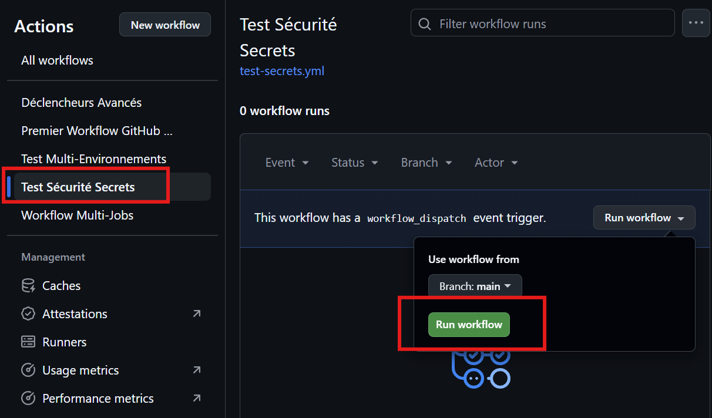
- Vérifier que le secret n'apparaît PAS en clair dans les logs
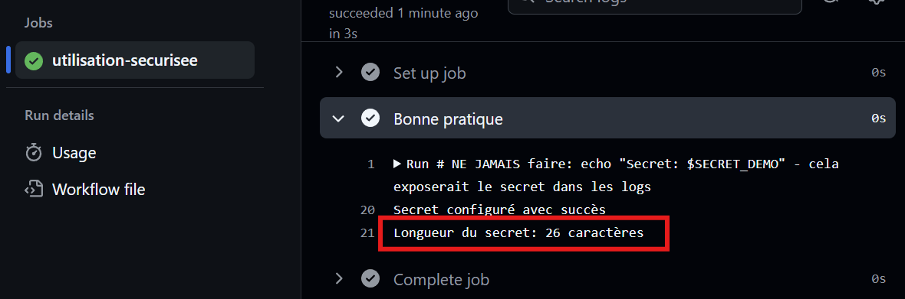
---

## Partie 8 : Artefacts et Fichiers

### Exercice 8.1 : Gestion d'Artefacts
**Durée** : 20 minutes

**Instructions** :
1. **Workflow artefacts** : `artefacts.yml`
2. **Contenu** :
```yaml
# Workflow: Gestion Artefacts
# Description: Démonstration de la création, upload et download d'artefacts entre jobs
# Montre comment partager des fichiers entre différents jobs d'un workflow

name: Gestion Artefacts

# Déclenchement manuel pour plus de contrôle
on: [workflow_dispatch]

jobs:
  # Job: Génération des fichiers et artefacts
  # Objectif: Créer des fichiers de test et les uploader en tant qu'artefacts
  generation:
    runs-on: ubuntu-latest
    
    steps:
    # Étape: Création des fichiers de test
    - name: Créer fichiers test
      run: |
        # Création de fichiers texte et JSON
        echo "Fichier de configuration" > config.txt
        echo '{"build": "data", "timestamp": "'$(date)'"}' > data.json
        
        # Création d'un répertoire avec des logs
        mkdir -p logs
        echo "Logs système - $(date)" > logs/system.log
        
        # Vérification de la création des fichiers
        echo "Fichiers créés:"
        ls -la
        echo "Contenu du dossier logs:"
        ls -la logs/
    
    # Étape: Upload des artefacts pour partage entre jobs
    # IMPORTANT: Cette étape doit être dans le MÊME job que la création des fichiers
    - name: Upload artefacts
      uses: actions/upload-artifact@v4
      with:
        # Nom unique de l'artefact pour référence ultérieure
        name: bundle-production
        
        # Patterns de fichiers à inclure dans l'artefact
        path: |
          *.txt
          *.json
          logs/
        
        # Durée de rétention automatique (7 jours)
        retention-days: 7

  # Job: Vérification des artefacts téléchargés
  # Objectif: Télécharger et vérifier les artefacts du job précédent
  # IMPORTANT: Ce job dépend du job 'generation' via 'needs'
  verification:
    runs-on: ubuntu-latest
    needs: generation  # Dépendance critique: assure que le job generation est terminé
    
    steps:
    # Étape: Download des artefacts du job précédent
    - name: Download artefacts
      uses: actions/download-artifact@v4
      with:
        # Doit correspondre exactement au nom utilisé dans l'upload
        name: bundle-production
      
    # Étape: Vérification du contenu téléchargé
    - name: Lister fichiers
      run: |
        # Affiche la structure des fichiers téléchargés
        echo "=== Structure des fichiers téléchargés ==="
        ls -la
        
        echo "=== Contenu des fichiers ==="
        echo "--- config.txt ---"
        cat config.txt
        echo "--- data.json ---"
        cat data.json
        
        echo "=== Contenu du dossier logs ==="
        ls -la logs/
        echo "--- logs/system.log ---"
        cat logs/system.log
```

3. **Commit** : "Workflow gestion artefacts"

**Observation** :
- Exécuter le workflow
- Après exécution, dans la page du workflow run :
  - Section **"Artifacts"**
  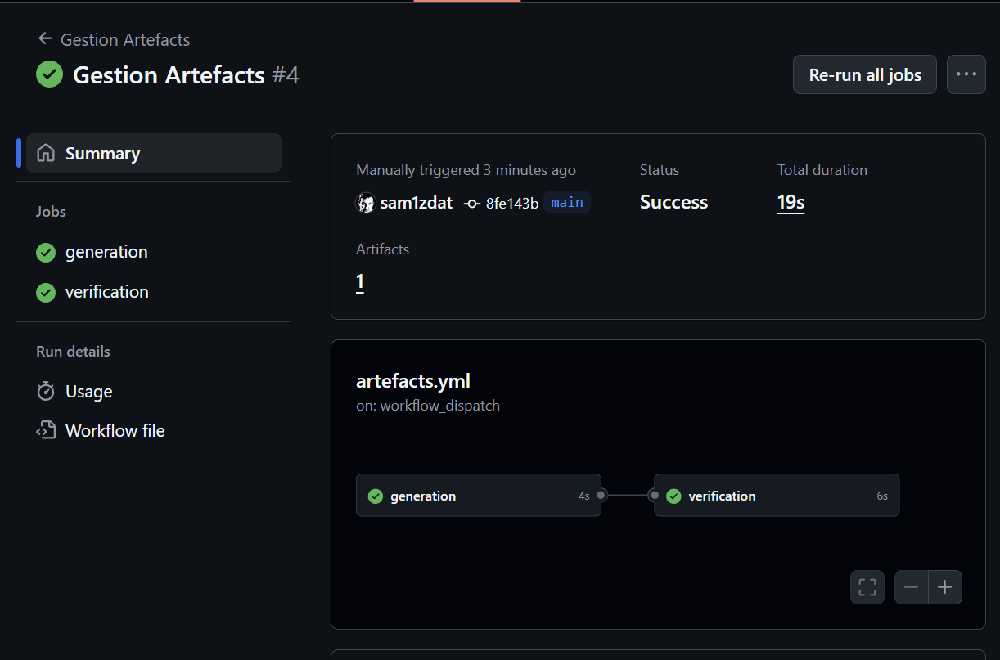
  - Télécharger le bundle
  - Vérifier les fichiers générés
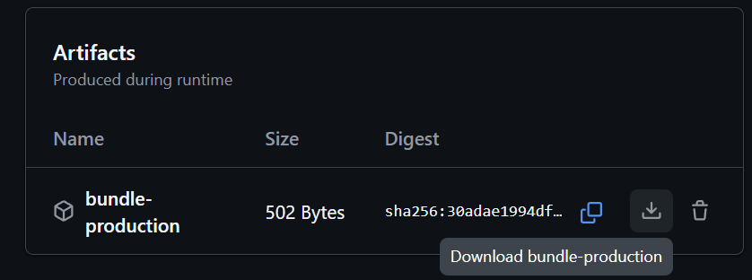
---

## Partie 9 : Pipeline CI Complet

### Exercice 9.1 : Intégration Continue
**Durée** : 30 minutes

**Instructions** :
1. **Préparer le projet** :
   - Onglet **"Code"** → **"Add file"** → **"Create new file"**
   - Nom : `package.json`
   - Contenu :
     ```json
     {
       "name": "mon-projet-test",
       "version": "1.0.0",
       "scripts": {
         "test": "echo 'Tests exécutés avec succès' && exit 0",
         "lint": "echo 'Linting OK'",
         "build": "echo 'Build réussi' > dist/bundle.js"
       }
     }
     ```
   - Committer : "Ajout package.json"

2. **Workflow CI** : `pipeline-ci.yml`
   ```yaml
   name: Pipeline CI Complet
   
   on:
     push:
       branches: [main]
     pull_request:
       branches: [main]
   
   jobs:
     qualite:
       runs-on: ubuntu-latest
       steps:
       - uses: actions/checkout@v4
       
       - name: Installation dépendances
         run: echo "Simulation npm install"
       
       - name: Linting
         run: npm run lint
       
       - name: Tests
         run: npm test
     
     build:
       runs-on: ubuntu-latest
       needs: qualite
       strategy:
         matrix:
           os: [ubuntu-latest, windows-latest]
       
       steps:
       - uses: actions/checkout@v4
       
       - name: Build
         run: |
           # Création du répertoire de destination des artefacts
           mkdir -p dist
           npm run build

        # Étape: Sauvegarde des artefacts de build
        # Objectif: Rendre les builds disponibles pour déploiement ou téléchargement       
       - name: Upload build
         uses: actions/upload-artifact@v4
         with:
           name: build-${{ matrix.os }}

           # Chemin vers les artefacts à sauvegarder
           path: dist/
   ```

3. **Commit** : "Pipeline CI complet"

**Test** :
- Le workflow se déclenche automatiquement sur le commit
- Observer les deux jobs s'exécuter
- Vérifier les artefacts générés
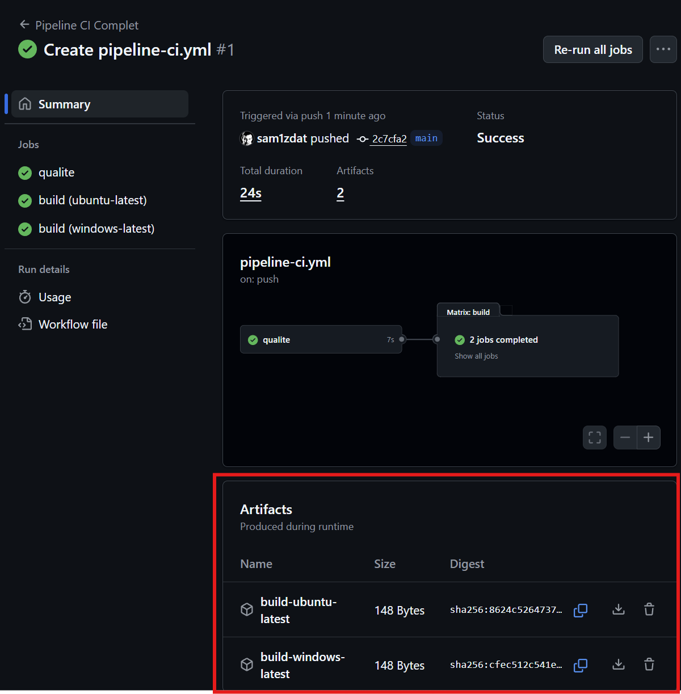
---

## Partie 10 : Projet Final

### Exercice 10.1 : Workflow de Déploiement Conditionnel
**Durée** : 25 minutes

**Instructions** :
1. **Workflow final** : `deploiement-conditionnel.yml`
2. **Contenu** :
   ```yaml
   name: Déploiement Conditionnel
   
   # Déclenchement manuel avec paramètres d'entrée pour plus de contrôle
   on:
     workflow_dispatch:
       inputs:
         environment:
           description: 'Environnement de déploiement'
           required: true
           default: 'staging'
           type: choice
           options:
           - staging
           - production
   
   jobs:
     validation:
       runs-on: ubuntu-latest
       steps:
       - name: Vérifications
         run: |
           echo "Validation des prérequis"
           echo "Environnement choisi: ${{ github.event.inputs.environment }}"
     
     deploy:
       runs-on: ubuntu-latest
       needs: validation
       environment: ${{ github.event.inputs.environment }}
       
       steps:
       - name: Déploiement
         run: |
           echo "🚀 Déploiement vers ${{ github.event.inputs.environment }}"
           
           if [ "${{ github.event.inputs.environment }}" == "production" ]; then
             echo "🔒 Déploiement PRODUCTION - vérifications renforcées"
           else
             echo "🟡 Déploiement STAGING - environnement de test"
           fi
       
       - name: Notification
         if: always()
         run: |
           if [ "${{ job.status }}" == "success" ]; then
             echo "✅ Déploiement réussi"
           else
             echo "❌ Échec du déploiement"
           fi
   ```

3. **Commit** : "Workflow déploiement conditionnel"

**Test avancé** :
- Exécuter manuellement le workflow
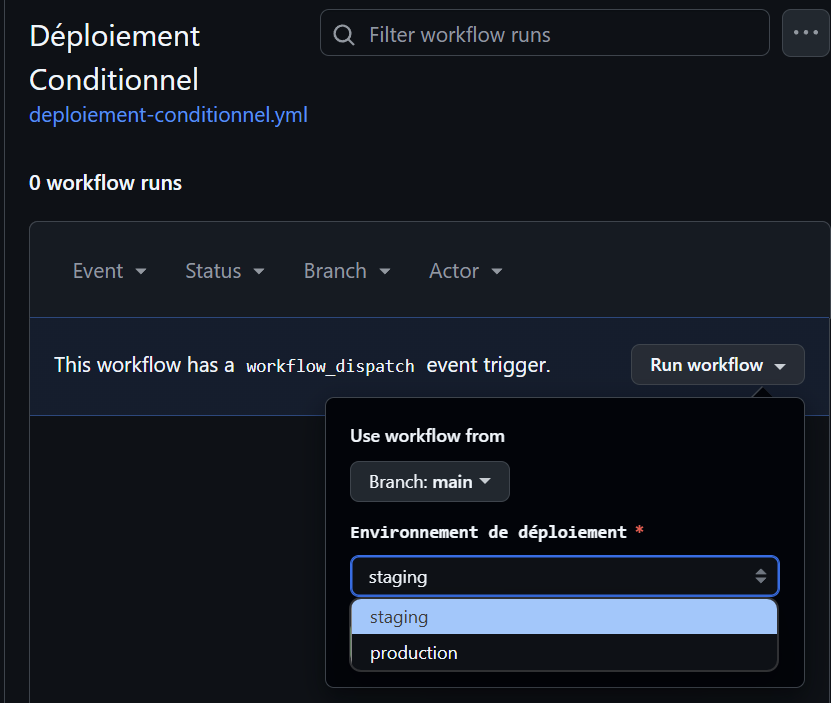
- Choisir l'environnement dans le menu déroulant
- Observer les différences selon l'environnement choisi

---

## Grille d'Évaluation

| Critère | Points | Validation |
|---------|--------|------------|
| ✅ Workflow Hello World | 10 | Exécuté sans erreur |
| ✅ Navigation interface | 10 | Pages maîtrisées |
| ✅ Jobs séquentiels | 15 | Dépendances fonctionnelles |
| ✅ Matrices multi-OS | 15 | 4 jobs parallèles visibles |
| ✅ Déclencheurs événements | 10 | Workflow sur création issue |
| ✅ Secrets sécurisés | 10 | Pas d'exposition en logs |
| ✅ Artefacts générés | 10 | Fichiers téléchargeables |
| ✅ Pipeline CI complet | 10 | Tests + build fonctionnels |
| ✅ Déploiement conditionnel | 10 | Choix d'environnement |
| **Total** | **100** | |

---

## Livrables

1. **URL du repository GitHub** avec tous les workflows
2. **Captures d'écran** de chaque workflow en action
3. **Tableau récapitulatif** :
   | Workflow | Statut | Temps moyen | Observations |
   |----------|--------|-------------|--------------|
   | Premier Workflow | ✅ | ~30s | Base maîtrisée |
   | Multi-Jobs | ✅ | ~45s | Séquence correcte |
   | Multi-OS | ✅ | ~2min | 4 jobs parallèles |
   | ... | ... | ... | ... |

4. **Liste des artefacts** générés avec leurs tailles

---