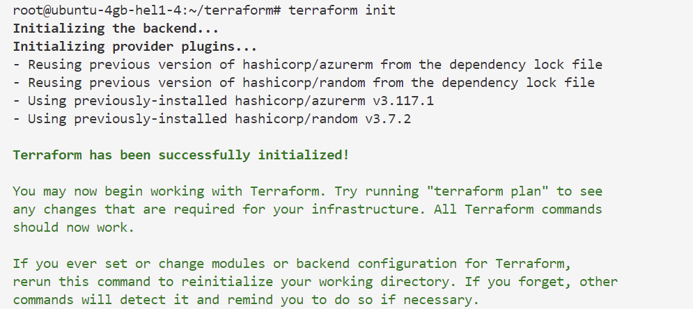
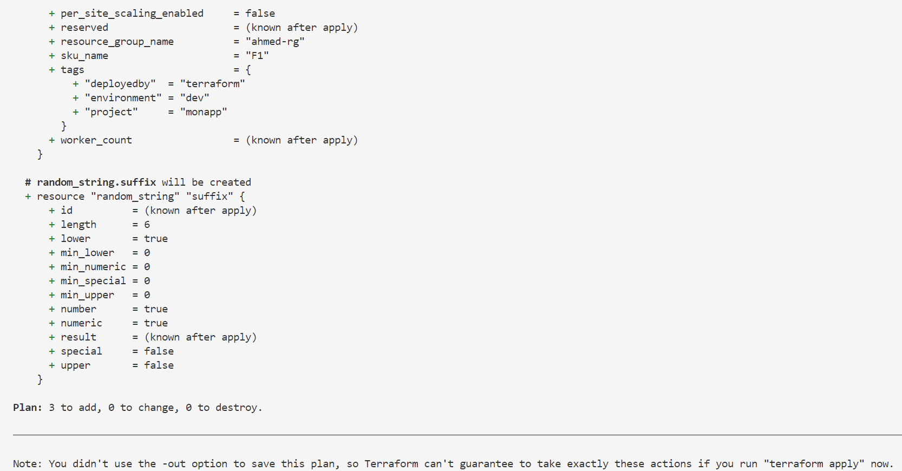
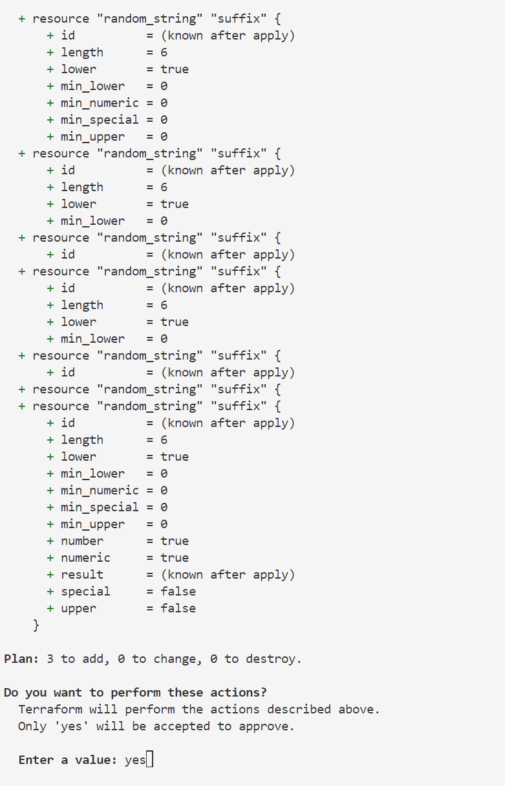
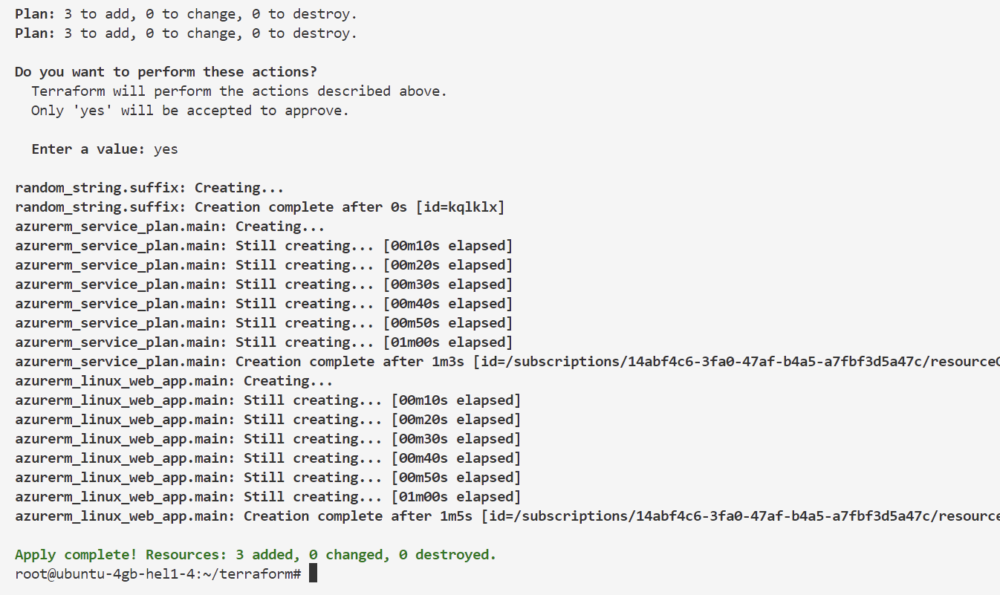
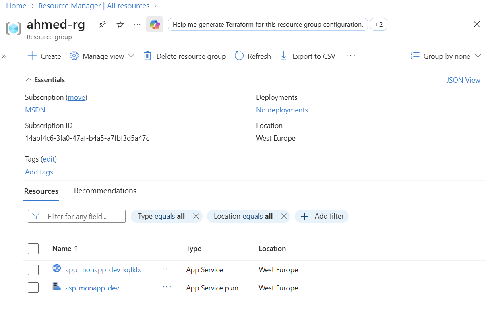
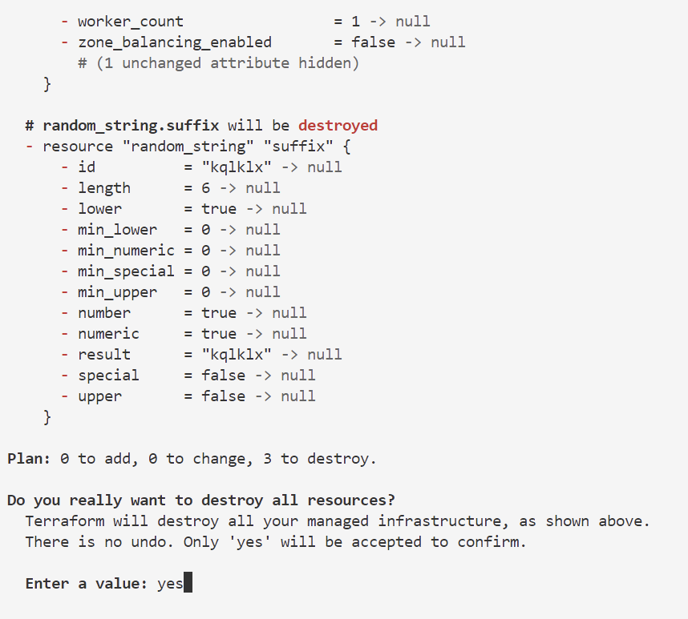

# 🚀 TP Terraform Complet - Installation et Déploiement Azure

## 📋 Prérequis Complets

### ✅ Ce dont vous avez besoin
- [ ] Machine Linux (Ubuntu 20.04+ recommandé)
- [ ] Accès administrateur (sudo)
- [ ] Connexion Internet
- [ ] Compte Azure avec abonnement actif

---
## 🔧 ÉTAPE 0 : Installation de Terraform sur Linux

### 0.1 Mise à jour du système
```bash
# Mettre à jour les paquets
sudo apt update && sudo apt upgrade -y

# Installer les dépendances nécessaires
sudo apt install -y curl wget gnupg software-properties-common
```

### 0.2 Installation de Terraform
```bash
# Ajouter la clé HashiCorp
wget -O- https://apt.releases.hashicorp.com/gpg | sudo gpg --dearmor -o /usr/share/keyrings/hashicorp-archive-keyring.gpg

# Ajouter le repository HashiCorp
echo "deb [signed-by=/usr/share/keyrings/hashicorp-archive-keyring.gpg] https://apt.releases.hashicorp.com $(lsb_release -cs) main" | sudo tee /etc/apt/sources.list.d/hashicorp.list

# Mettre à jour et installer Terraform
sudo apt update
sudo apt install terraform

# Vérifier l'installation
terraform --version
```

### 0.3 Installation d'Azure CLI
```bash
# Télécharger et installer Azure CLI
curl -sL https://aka.ms/InstallAzureCLIDeb | sudo bash

# Vérifier l'installation
az --version
```

### 0.4 Configuration de l'autocomplétion (optionnel)
```bash
# Autocomplétion Terraform
terraform -install-autocomplete

# Autocomplétion Azure CLI
az completion --shell bash | sudo tee /etc/bash_completion.d/az
```
---

## 🔐 ÉTAPE 1 : Connexion Azure avec Login/Password

### 1.1 Connexion interactive Azure CLI
```bash
# Se connecter à Azure
az login

# Si vous avez plusieurs abonnements
az account list --output table

# Définir l'abonnement par défaut
az account set --subscription "VOTRE-SUBSCRIPTION-ID"

# Vérifier la connexion
az account show
```

### 1.2 Configuration Terraform pour connexion interactive
```hcl
# providers.tf - Version avec authentification interactive
terraform {
  required_version = ">= 1.0"
  
  required_providers {
    azurerm = {
      source  = "hashicorp/azurerm"
      version = "~> 3.0"
    }
    random = {
      source  = "hashicorp/random"
      version = "~> 3.0"
    }
  }
}

# Provider Azure avec authentification automatique
provider "azurerm" {
  features {}
  
  # Terraform utilisera automatiquement la session az login
  # Aucune configuration d'authentification nécessaire
}
```

### 1.3 Variables simplifiées
```hcl
# variables.tf
variable "project_name" {
  description = "Nom de votre projet"
  type        = string
  default     = "myapp"
}

variable "environment" {
  description = "Environnement de déploiement"
  type        = string
  default     = "dev"
}

variable "location" {
  description = "Région Azure"
  type        = string
  default     = "westeurope"
}

variable "app_service_sku" {
  description = "SKU App Service"
  type        = string
  default     = "F1"
}

# 🔥 Nom du Resource Group existant
variable "existing_resource_group_name" {
  description = "Nom du Resource Group existant"
  type        = string
}

variable "existing_resource_group_location" {
  description = "Localisation du Resource Group existant"
  type        = string
  default     = "westeurope"
}
```

### 1.4 Terraform principal avec RG existant
```hcl
# main.tf - Utilisation d'un Resource Group existant

# Data source pour récupérer le Resource Group existant
data "azurerm_resource_group" "existing" {
  name = var.existing_resource_group_name
}

# Plan App Service
resource "azurerm_service_plan" "main" {
  name                = "asp-${var.project_name}-${var.environment}"
  resource_group_name = data.azurerm_resource_group.existing.name
  location            = data.azurerm_resource_group.existing.location
  os_type             = "Linux"
  sku_name            = var.app_service_sku

  tags = {
    environment = var.environment
    project     = var.project_name
    deployedby  = "terraform"
  }
}

# Application Web
resource "azurerm_linux_web_app" "main" {
  name                = "app-${var.project_name}-${var.environment}-${random_string.suffix.result}"
  resource_group_name = data.azurerm_resource_group.existing.name
  location            = data.azurerm_resource_group.existing.location
  service_plan_id     = azurerm_service_plan.main.id

  site_config {
    application_stack {
      node_version = "18-lts"
    }
    always_on = false
  }

  app_settings = {
    "WEBSITE_NODE_DEFAULT_VERSION" = "18-lts"
    "NODE_ENV" = "production"
  }

  tags = {
    environment = var.environment
    project     = var.project_name
  }
}

resource "random_string" "suffix" {
  length  = 6
  special = false
  upper   = false
}
```

### 1.5 Fichier de variables
```hcl
# terraform.tfvars
project_name    = "monapp"
environment     = "dev"
location        = "westeurope"
app_service_sku = "F1"

# 🔥 Resource Group existant - À MODIFIER
existing_resource_group_name = "rg-mon-groupe-existant"
```

---

## 🔧 ÉTAPE 2 : Création du Resource Group (si nécessaire)

### 2.1 Script pour créer le Resource Group(non nécessaire dans notre labs)
```bash
#!/bin/bash
# scripts/create-resource-group.sh

RESOURCE_GROUP_NAME="ahmed-rg"
LOCATION="westeurope"

echo "📦 Création du Resource Group: $RESOURCE_GROUP_NAME"

az group create \
  --name $RESOURCE_GROUP_NAME \
  --location $LOCATION \
  --tags "Environment=Dev" "Project=MonApp"

echo "✅ Resource Group créé: $RESOURCE_GROUP_NAME"
```

Exécuter le script:
```bash
chmod +x scripts/create-resource-group.sh
./scripts/create-resource-group.sh
```

---

## 🤖 ÉTAPE 3 : Configuration GitHub Action

### 3.1 Structure du repository
```
.github/
└── workflows/
    └── deploy-azure-webapp.yml
terraform/
├── providers.tf
├── variables.tf
├── main.tf
├── outputs.tf
└── terraform.tfvars
scripts/
└── setup.sh
```

### 3.2 GitHub Action - `.github/workflows/deploy-azure-webapp.yml`
```yaml
name: Deploy Azure Web App

on:
  push:
    branches: [ main, develop ]
  pull_request:
    branches: [ main ]
  workflow_dispatch:  # Déclenchement manuel

env:
  AZURE_WEBAPP_NAME: 'app-monapp-dev'
  AZURE_RESOURCE_GROUP: 'ahmed-rg'  # Resource Group existant
  TERRAFORM_VERSION: '1.5.0'

jobs:
  terraform:
    name: 'Terraform Plan/Apply'
    runs-on: ubuntu-latest
    environment: production
    
    steps:
    # Étape 1: Checkout du code
    - name: Checkout
      uses: actions/checkout@v4

    # Étape 2: Configuration Azure Login
    - name: Login to Azure
      uses: azure/login@v1
      with:
        creds: ${{ secrets.AZURE_CREDENTIALS }}

    # Étape 3: Setup Terraform
    - name: Setup Terraform
      uses: hashicorp/setup-terraform@v2
      with:
        terraform_version: ${{ env.TERRAFORM_VERSION }}

    # Étape 4: Terraform Init
    - name: Terraform Init
      id: init
      run: terraform init
      working-directory: ./terraform

    # Étape 5: Terraform Format
    - name: Terraform Format
      id: fmt
      run: terraform fmt -check
      working-directory: ./terraform

    # Étape 6: Terraform Validate
    - name: Terraform Validate
      id: validate
      run: terraform validate -no-color
      working-directory: ./terraform

    # Étape 7: Terraform Plan
    - name: Terraform Plan
      id: plan
      run: |
        terraform plan \
          -var="existing_resource_group_name=${{ env.AZURE_RESOURCE_GROUP }}" \
          -var="project_name=monapp" \
          -var="environment=dev" \
          -out=tfplan
      working-directory: ./terraform

    # Étape 8: Terraform Apply (seulement sur main et déclenchement manuel)
    - name: Terraform Apply
      if: github.ref == 'refs/heads/main' || github.event_name == 'workflow_dispatch'
      id: apply
      run: terraform apply -auto-approve tfplan
      working-directory: ./terraform

    # Étape 9: Output des résultats
    - name: Terraform Outputs
      if: github.ref == 'refs/heads/main' || github.event_name == 'workflow_dispatch'
      run: terraform output
      working-directory: ./terraform

  # Job de vérification
  verify:
    name: 'Verify Deployment'
    runs-on: ubuntu-latest
    needs: terraform
    if: github.ref == 'refs/heads/main' || github.event_name == 'workflow_dispatch'
    
    steps:
    - name: Checkout
      uses: actions/checkout@v4

    - name: Login to Azure
      uses: azure/login@v1
      with:
        creds: ${{ secrets.AZURE_CREDENTIALS }}

    - name: Verify Web App
      run: |
        az webapp show \
          --name ${{ env.AZURE_WEBAPP_NAME }} \
          --resource-group ${{ env.AZURE_RESOURCE_GROUP }} \
          --query "{Name:name, State:state, URL:defaultHostName}" \
          --output table

    - name: Test Web App URL
      run: |
        URL=$(az webapp show \
          --name ${{ env.AZURE_WEBAPP_NAME }} \
          --resource-group ${{ env.AZURE_RESOURCE_GROUP }} \
          --query "defaultHostName" -o tsv)
        echo "🌐 Application URL: https://$URL"
        curl -s -I "https://$URL" | head -n 1
```

### 3.3 GitHub Action Alternative (plus simple)
```yaml
name: Deploy Azure Web App - Simple

on:
  push:
    branches: [ main ]

jobs:
  deploy:
    runs-on: ubuntu-latest
    
    steps:
    - uses: actions/checkout@v4

    - name: Azure Login
      uses: azure/login@v1
      with:
        creds: ${{ secrets.AZURE_CREDENTIALS }}

    - name: Setup Terraform
      uses: hashicorp/setup-terraform@v2

    - name: Terraform Init & Apply
      run: |
        cd terraform
        terraform init
        terraform apply -auto-approve \
          -var="existing_resource_group_name=ahmed-rg" \
          -var="project_name=monapp" \
          -var="environment=dev"
```

---

## 🔐 ÉTAPE 4 : Configuration des Secrets GitHub

### 4.1 Création des credentials Azure pour GitHub(tâche à demander au formateur)
```bash
# Créer un Service Principal pour GitHub Actions
az ad sp create-for-rbac \
  --name "github-actions-monapp" \
  --role "Contributor" \
  --scopes "/subscriptions/VOTRE-SUBSCRIPTION-ID/resourceGroups/ahmed-rg" \
  --sdk-auth
```

### 4.2 Sortie attendue - **À COPIER DANS GITHUB SECRETS**
```json
{
  "clientId": "xxxxxx-xxxx-xxxx-xxxx-xxxxxxxxxxxx",
  "clientSecret": "xxxxxx-xxxx-xxxx-xxxx-xxxxxxxxxxxx", 
  "subscriptionId": "xxxxxx-xxxx-xxxx-xxxx-xxxxxxxxxxxx",
  "tenantId": "xxxxxx-xxxx-xxxx-xxxx-xxxxxxxxxxxx",
  "activeDirectoryEndpointUrl": "https://login.microsoftonline.com",
  "resourceManagerEndpointUrl": "https://management.azure.com/",
  "activeDirectoryGraphEndpointUrl": "https://graph.windows.net/",
  "sqlManagementEndpointUrl": "https://management.core.windows.net:8443/",
  "galleryEndpointUrl": "https://gallery.azure.com/",
  "managementEndpointUrl": "https://management.core.windows.net/"
}
```

### 4.3 Configuration dans GitHub
1. Allez dans votre repository GitHub → **Settings** → **Secrets and variables** → **Actions**
2. Cliquez sur **New repository secret**
3. Nom: `AZURE_CREDENTIALS`
4. Valeur: *Collez le JSON complet ci-dessus*

---

## 🧪 ÉTAPE 5 : Test Complet

### 5.1 Test local d'abord
```bash
# Se connecter à Azure
az login

# Tester le déploiement local
cd terraform
```bash
terraform init
```

```bash
terraform plan -var="existing_resource_group_name=ahmed-rg"
```

```bash
terraform apply -var="existing_resource_group_name=ahmed-rg"
```






# Détruire toutes les ressources créées
```bash
terraform destroy
```

# Confirmer la destruction en tapant 'yes'


## 📋 ÉTAPE 5 : Vérification des fichiers dans github

### 5.1 `terraform/providers.tf`
```hcl
terraform {
  required_version = ">= 1.0"
  required_providers {
    azurerm = {
      source  = "hashicorp/azurerm"
      version = "~> 3.0"
    }
    random = {
      source  = "hashicorp/random"
      version = "~> 3.0"
    }
  }
}

provider "azurerm" {
  features {}
}
```

### 5.2 `terraform/outputs.tf`
```hcl
output "web_app_name" {
  description = "Nom de l'application web"
  value       = azurerm_linux_web_app.main.name
}

output "web_app_url" {
  description = "URL de l'application"
  value       = "https://${azurerm_linux_web_app.main.default_hostname}"
}

output "web_app_id" {
  description = "ID de l'application web"
  value       = azurerm_linux_web_app.main.id
}

output "service_plan_id" {
  description = "ID du App Service Plan"
  value       = azurerm_service_plan.main.id
}
```

### 5.3 `.gitignore`
```
# Fichiers Terraform
.terraform/
*.tfstate
*.tfstate.backup
.terraform.tfstate.lock.info

# Fichiers sensibles
*.env
.azure/
terraform.tfvars

# Fichiers de lock
.terraform.lock.hcl
```

---

## 🚀 ÉTAPE 6 : Déploiement

### 6.1 Processus de déploiement
```bash
# 1. Initialiser le repository Git
git init
git add .
git commit -m "Initial commit with Terraform and GitHub Action"

# 2. Créer le repository sur GitHub et pousser
git remote add origin https://github.com/votre-username/votre-repo.git
git branch -M main
git push -u origin main

# 3. Configurer les secrets dans GitHub
#    - Settings → Secrets → Actions → New secret
#    - Nom: AZURE_CREDENTIALS
#    - Valeur: JSON du Service Principal

# 4. L'Action se déclenche automatiquement!
```

### 6.2 Vérification du déploiement
```bash
# Vérifier manuellement les ressources
az webapp list --resource-group ahmed-rg --output table
az appservice plan list --resource-group ahmed-rg --output table
```

---

## 🛠️ Dépannage GitHub Action

### Problème: Erreur d'authentification
```yaml
# Vérifier que le secret AZURE_CREDENTIALS est bien configuré
# Le JSON doit être exact, sans espaces supplémentaires
```

### Problème: Resource Group non trouvé
```bash
# Créer le Resource Group manuellement
az group create --name ahmed-rg --location westeurope
```

### Problème: Nom d'application déjà utilisé
```hcl
# Modifier dans main.tf pour utiliser un suffixe aléatoire
name = "app-${var.project_name}-${var.environment}-${random_string.suffix.result}"
```

---

## ✅ Checklist Finale

- [ ] Azure CLI installé et connecté (`az login`)
- [ ] Resource Group existant créé
- [ ] Fichiers Terraform configurés pour RG existant
- [ ] GitHub Action créée dans `.github/workflows/`
- [ ] Service Principal créé pour GitHub
- [ ] Secret `AZURE_CREDENTIALS` configuré dans GitHub
- [ ] Code poussé sur la branche `main`
- [ ] GitHub Action s'exécute avec succès
- [ ] Application web accessible via l'URL générée

**Félicitations!** 🎉 Vous avez maintenant un pipeline CI/CD complet qui déploie automatiquement sur Azure à chaque push!