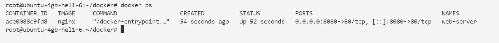

# TP Docker - Gestion des conteneurs

## Objectifs du TP
- Comprendre les concepts de base de Docker
- Maîtriser les commandes Docker essentielles
- Créer et gérer des conteneurs
- Construire des images personnalisées

---

## Exercice 1 : Installation et vérification

### 1.1 Installation de Docker
```bash
# Sur Ubuntu/Debian
sudo apt update
sudo apt install docker.io

# Vérifier l'installation
docker --version
```

### 1.2 Test de fonctionnement
```bash
# Lancer un conteneur de test
docker run hello-world

# Vérifier que le conteneur s'est exécuté correctement
docker ps -a
```

---

## Exercice 2 : Commandes de base Docker

### 2.1 Gestion des images
```bash
# Télécharger une image Ubuntu
docker pull ubuntu:20.04

# Lister les images locales
docker images

# Supprimer une image
docker rmi <image_id>
```

### 2.2 Gestion des conteneurs
```bash
# Lancer un conteneur interactif
docker run -it ubuntu:20.04 /bin/bash

# Dans le conteneur, installer un package
apt update && apt install -y curl

# Quitter le conteneur
exit
```

### 2.3 Conteneurs en arrière-plan
```bash
# Lancer un conteneur Nginx
docker run -d --name web-server -p 8080:80 nginx
```


```bash
# Vérifier que le conteneur tourne
docker ps
```



```bash
# Accéder au serveur web
curl http://localhost:8080
```


```bash
# Arrêter le conteneur
docker stop web-server
```

---

## Exercice 3 : Dockerfile - Création d'image personnalisée

### 3.1 Structure du projet
Créez la structure suivante :
```
mon-app/
├── Dockerfile
├── app.py
└── requirements.txt
```

### 3.2 Fichier app.py
```python
from flask import Flask
import os

app = Flask(__name__)

@app.route('/')
def hello():
    return f"Hello from Docker! Hostname: {os.uname().nodename}"

@app.route('/health')
def health():
    return "OK"

if __name__ == '__main__':
    app.run(host='0.0.0.0', port=5000)
```

### 3.3 Fichier requirements.txt
```
Flask==2.3.3
```

### 3.4 Dockerfile
```dockerfile
# Image de base
FROM python:3.9-slim

# Définir le répertoire de travail
WORKDIR /app

# Copier les fichiers de requirements
COPY requirements.txt .

# Installer les dépendances
RUN pip install --no-cache-dir -r requirements.txt

# Copier le code de l'application
COPY app.py .

# Exposer le port
EXPOSE 5000

# Commande pour lancer l'application
CMD ["python", "app.py"]
```

### 3.5 Construction et exécution
```bash
# Construire l'image
docker build -t mon-app-flask .
```

```bash
# Lancer le conteneur
docker run -d --name my-app -p 5000:5000 mon-app-flask

# Tester l'application
curl http://localhost:5000
```


---
