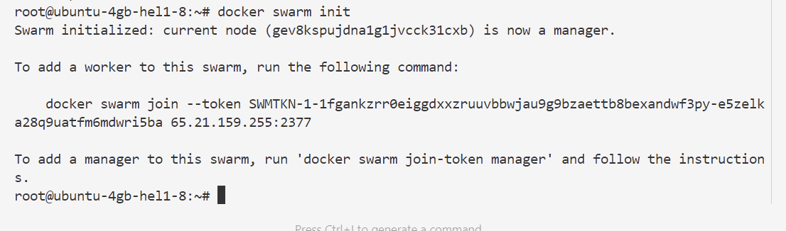
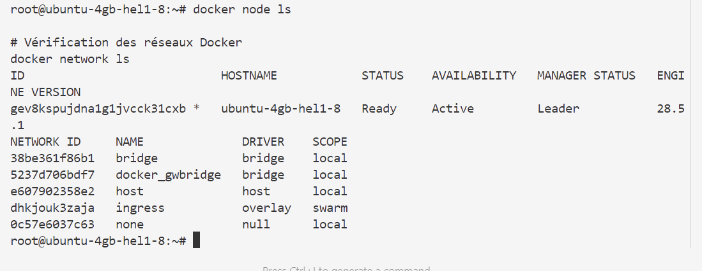
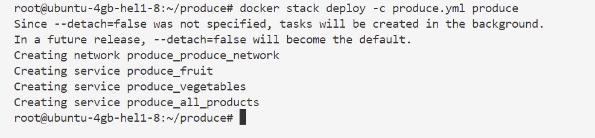
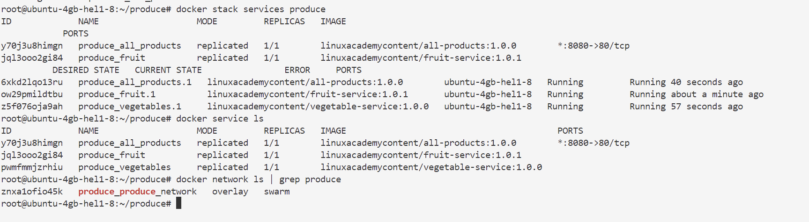
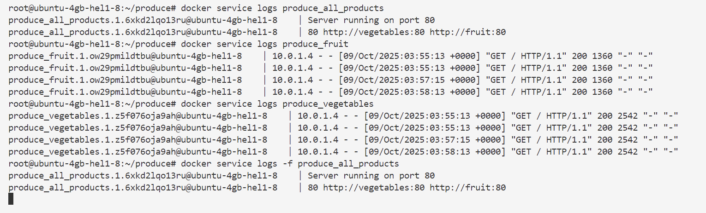
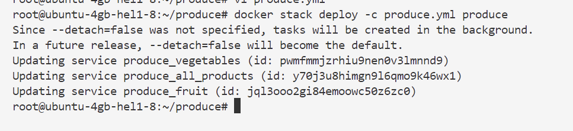

# TP : Construction d'une Stack d'Application Docker avec Docker Swarm

## Introduction
Les stacks sont l'une des fonctionnalités d'orchestration les plus puissantes disponibles dans Docker Swarm. Elles vous permettent de gérer facilement des applications complexes composées de multiples composants interdépendants s'exécutant dans des conteneurs séparés.

Dans ce TP, vous allez travailler avec des stacks Docker en construisant une application multi-composants comme stack Docker. Vous apprendrez également à gérer les stacks existants en mettant à l'échelle les services d'une stack après son déploiement.

## Architecture de l'Application
```
Stack "produce"
├── Service "fruit" (3 réplicas)
├── Service "vegetables" (3 réplicas)  
└── Service "all_products" (1 réplica)
    └── Exposition du port 8080
```

---

## Étape 1 : Installation et Configuration de Docker

### 1.1 Connexion au Serveur
```bash
# Connexion SSH au serveur du lab
ssh root@PUBLIC_IP_ADDRESS

# Vérification de la connexion
whoami
pwd
```

### 1.2 Installation de Docker Engine
```bash
# Mise à jour du système
sudo apt-get update

# Installation des paquets nécessaires
sudo apt-get install -y \
    apt-transport-https \
    ca-certificates \
    curl \
    gnupg \
    lsb-release

# Ajout de la clé GPG officielle Docker
curl -fsSL https://download.docker.com/linux/ubuntu/gpg | sudo gpg --dearmor -o /usr/share/keyrings/docker-archive-keyring.gpg

# Ajout du repository Docker
echo \
  "deb [arch=amd64 signed-by=/usr/share/keyrings/docker-archive-keyring.gpg] https://download.docker.com/linux/ubuntu \
  $(lsb_release -cs) stable" | sudo tee /etc/apt/sources.list.d/docker.list > /dev/null

# Installation de Docker Engine
sudo apt-get update
sudo apt-get install -y docker-ce docker-ce-cli containerd.io

# Vérification de l'installation
docker --version
```

### 1.3 Configuration des Permissions Docker
```bash
# Ajout de l'utilisateur au groupe docker (évite d'utiliser sudo)
sudo usermod -aG docker $USER

# Rechargement des groupes (ou reconnexion SSH)
newgrp docker

# Vérification que docker fonctionne sans sudo
docker ps
```

### 1.4 Initialisation de Docker Swarm
```bash
# Initialisation du swarm Docker
docker swarm init

# Sortie attendue :
# Swarm initialized: current node (xxx) is now a manager.
# To add a worker to this swarm, run the following command:
#     docker swarm join --token SWMTKN-xxx...

# Vérification du statut du swarm
docker node ls

# Vérification des réseaux Docker
docker network ls
```




**Explication des concepts Swarm :**
- **Manager Node** : Nœud qui gère le cluster Swarm
- **Worker Node** : Nœud qui exécute les conteneurs  
- **Overlay Network** : Réseau virtuel pour la communication entre services
- **Service** : Définition d'un composant applicatif avec ses réplicas

---

## Étape 2 : Construction et Déploiement de la Stack d'Application

### 2.1 Création de la Structure du Projet
```bash
# Navigation dans le répertoire home
cd ~/

# Création du répertoire du projet
mkdir produce

# Navigation dans le répertoire
cd produce

# Affichage du chemin actuel pour confirmation
pwd
```

### 2.2 Création du Fichier Docker Compose

**Fichier : `produce.yml`**

```bash
# Création et édition du fichier compose
vi produce.yml
```

**Contenu du fichier :**
```yaml
# Version de la syntaxe Docker Compose
version: '3.8'

# Définition des services qui composent notre application
services:
  # Service Fruit - fournit une API de fruits
  fruit:
    # Image Docker du service fruit
    image: linuxacademycontent/fruit-service:1.0.1
    # Configuration de déploiement Swarm
    deploy:
      # Mode de réplication (par défaut 1 réplica)
      replicas: 1
      # Stratégie de mise à jour
      update_config:
        parallelism: 1
        delay: 10s
      # Politique de redémarrage
      restart_policy:
        condition: any
        delay: 5s
        max_attempts: 3
        window: 120s
    # Réseaux connectés au service
    networks:
      - produce_network

  # Service Vegetables - fournit une API de légumes  
  vegetables:
    image: linuxacademycontent/vegetable-service:1.0.0
    deploy:
      replicas: 1
      update_config:
        parallelism: 1
        delay: 10s
      restart_policy:
        condition: any
        delay: 5s
        max_attempts: 3
        window: 120s
    networks:
      - produce_network

  # Service All Products - agrège les données des deux services
  all_products:
    image: linuxacademycontent/all-products:1.0.0
    # Exposition des ports (host:container)
    ports:
      - "8080:80"
    # Variables d'environnement pour la configuration
    environment:
      - FRUIT_HOST=fruit          # Nom du service fruit dans le réseau Docker
      - FRUIT_PORT=80             # Port interne du service fruit
      - VEGETABLE_HOST=vegetables # Nom du service vegetables
      - VEGETABLE_PORT=80         # Port interne du service vegetables
      - LOG_LEVEL=info            # Niveau de logging
    deploy:
      replicas: 1
      update_config:
        parallelism: 1
        delay: 10s
      restart_policy:
        condition: any
        delay: 5s
        max_attempts: 3
        window: 120s
    # Dépendances entre services (attendre que fruit et vegetables soient prêts)
    depends_on:
      - fruit
      - vegetables
    networks:
      - produce_network

# Définition des réseaux utilisés par les services
networks:
  produce_network:
    # Utilisation du driver overlay pour Swarm (communication multi-hôte)
    driver: overlay
    # Configuration supplémentaire du réseau
    attachable: true
```

**Explications des sections importantes :**

1. **`deploy`** : Configuration spécifique à Docker Swarm
2. **`networks`** : Isolation réseau entre services
3. **`depends_on`** : Ordre de démarrage des services
4. **`environment`** : Variables de configuration de l'application

### 2.3 Déploiement de la Stack
```bash
# Déploiement de la stack avec le fichier compose
docker stack deploy -c produce.yml produce

# Sortie attendue :
# Creating network produce_produce_network
# Creating service produce_fruit
# Creating service produce_vegetables  
# Creating service produce_all_products
```


### 2.4 Vérification du Déploiement
```bash
# Vérification des services de la stack
docker stack services produce

# Sortie attendue :
# ID             NAME                  MODE         REPLICAS   IMAGE                                       PORTS
# xxx1   produce_all_products   replicated   1/1        linuxacademycontent/all-products:1.0.0      *:8080->80/tcp
# xxx2   produce_fruit          replicated   1/1        linuxacademycontent/fruit-service:1.0.1
# xxx3   produce_vegetables     replicated   1/1        linuxacademycontent/vegetable-service:1.0.0

# Vérification des conteneurs en cours d'exécution
docker stack ps produce

# Inspection détaillée des services
docker service ls

# Vérification des réseaux créés
docker network ls | grep produce
```

---

## Étape 3 : Test de l'Application

### 3.1 Test de l'Endpoint Principal
```bash
# Test de l'application 
ouvrir localhost:8080

# Sortie attendue (format JSON) :
# {
#   "fruits": ["apple", "banana", "orange"],
#   "vegetables": ["carrot", "broccoli", "spinach"]
# }

# Test avec formatage JSON (si jq est installé)
curl -s localhost:8080 | jq .

# Test avec vérification HTTP détaillée
curl -v localhost:8080

# Test en boucle pour attendre que l'application soit prête
for i in {1..30}; do
    if curl -s localhost:8080 > /dev/null; then
        echo "✅ Application ready!"
        curl -s localhost:8080 | jq .
        break
    else
        echo "⏳ Waiting for application... ($i/30)"
        sleep 2
    fi
done
```

### 3.2 Vérification des Logs
```bash
# Consultation des logs du service all_products
docker service logs produce_all_products

# Consultation des logs du service fruit  
docker service logs produce_fruit

# Consultation des logs du service vegetables
docker service logs produce_vegetables

# Suivi des logs en temps réel
docker service logs -f produce_all_products
```

---
# Analyse des Logs Docker Swarm - Stack "produce"

## Résumé des Logs Observés

### 🔍 **État Actuel du Système**

D'après les logs, voici ce qui se passe dans votre stack Docker Swarm :

## 1. Logs du Service `produce_fruit`

```
produce_fruit.1.cw29pmildtbu@ubuntu-4gb-he11-8    | 10.0.1.4 - [09/Oct/2025:03:55:13 +0000] "GET / HTTP/1.1" 200 1360 "-" "-"
produce_fruit.1.cw29pmildtbu@ubuntu-4gb-he11-8    | 10.0.1.4 - [09/Oct/2025:03:55:13 +0000] "GET / HTTP/1.1" 200 1360 "-" "-"
produce_fruit.1.cw29pmildtbu@ubuntu-4gb-he11-8    | 10.0.1.4 - [09/Oct/2025:03:57:15 +0000] "GET / HTTP/1.1" 200 1360 "-" "-"
produce_fruit.1.cw29pmildtbu@ubuntu-4gb-he11-8    | 10.0.1.4 - [09/Oct/2025:03:58:13 +0000] "GET / HTTP/1.1" 200 1360 "-" "-"
```
---
**Analyse :**
- ✅ **Service fonctionnel** : Répond aux requêtes HTTP
- 📍 **Source** : Toutes les requêtes viennent de `10.0.1.4` (le service `all_products`)
- 🟢 **Statut** : Code HTTP `200` (succès)
- 📊 **Taille** : Réponses de `1360` octets
- ⏱️ **Fréquence** : Requêtes régulières

## 2. Logs du Service `produce_vegetables`

```
produce_vegetables.1.25f07Goja9ah@ubuntu-4gb-he11-8    | 10.0.1.4 - [09/Oct/2025:03:55:13 +0000] "GET / HTTP/1.1" 200 2542 "-" "-"
produce_vegetables.1.25f07Goja9ah@ubuntu-4gb-he11-8    | 10.0.1.4 - [09/Oct/2025:03:55:13 +0000] "GET / HTTP/1.1" 200 2542 "-" "-"
produce_vegetables.1.25f07Goja9ah@ubuntu-4gb-he11-8    | 10.0.1.4 - [09/Oct/2025:03:57:15 +0000] "GET / HTTP/1.1" 200 2542 "-" "-"
```

**Analyse :**
- ✅ **Service fonctionnel** : Répond aux requêtes HTTP
- 📍 **Source** : Même IP `10.0.1.4` (service `all_products`)
- 🟢 **Statut** : Code HTTP `200` (succès)
- 📊 **Taille** : Réponses de `2542` octets (plus gros que fruit)
- ⏱️ **Fréquence** : Requêtes synchronisées avec le service fruit

## 3. Logs du Service `produce_all_products`

```
produce_all_products.1.6xkd21qo13ru@ubuntu-4gb-he11-8    | Server running on port 80
produce_all_products.1.6xkd21qo13ru@ubuntu-4gb-he11-8    | 80 http://vegetables:80 http://fruit:80
```

**Analyse :**
- ✅ **Service démarré** : "Server running on port 80"
- 🔗 **Connexions établies** : Communication avec `vegetables:80` et `fruit:80`
- 🌐 **Résolution DNS** : Les noms de service fonctionnent correctement

## 🔧 **Diagnostic Complet**

### ✅ **Ce qui fonctionne :**

1. **Communication réseau** : 
   - Le service `all_products` (10.0.1.4) communique avec les deux autres services
   - La résolution DNS des noms de service (`fruit`, `vegetables`) fonctionne

2. **Services opérationnels** :
   - Tous les services répondent avec HTTP 200
   - Aucune erreur de connexion visible

3. **Architecture validée** :
   - `all_products` agit comme un aggregator
   - Appels simultanés aux services backend

### 📊 **Flux de Données :**

```
Utilisateur → produce_all_products:8080 → (parallèlement)
                                      ├→ produce_fruit:80 (1360 octets)
                                      └→ produce_vegetables:80 (2542 octets)
---

## Étape 4 : Mise à l'Échelle des Services

### 4.1 Modification du Fichier Compose
```bash
# Édition du fichier pour augmenter les réplicas
vi produce.yml
```
**Nouveau contenu :**
```yaml
# Déclaration de la version du format Docker Compose
# Version 3.8 supporte toutes les fonctionnalités Swarm modernes
version: '3.8'

# Section de définition des services (microservices)
services:
  # Service Fruit - fournit une API REST de fruits
  fruit:
    # Image Docker officielle du service fruit avec tag de version
    image: linuxacademycontent/fruit-service:1.0.1
    
    # Section de configuration spécifique à Docker Swarm
    deploy:
      # Nombre d'instances (réplicas) de ce service à exécuter
      # 🔥 3 réplicas permettent la haute disponibilité et le load balancing
      replicas: 3
      
      # Configuration de la stratégie de mise à jour en rolling
      update_config:
        # Nombre maximum de réplicas mis à jour simultanément
        # ⚡ 2 en parallèle = mise à jour plus rapide mais consommation ressources plus élevée
        parallelism: 2
        
        # Délai d'attente entre chaque lot de mise à jour
        # ⏱️ 5 secondes permettent au load balancer de se stabiliser
        delay: 5s
      
      # Politique de redémarrage automatique en cas d'échec
      restart_policy:
        # Redémarre dans tous les cas d'arrêt (any = toujours, on-failure = seulement sur échec)
        condition: any
        # Note: on pourrait ajouter max_attempts et window pour plus de contrôle
    
    # Connexion au réseau overlay pour communication inter-services
    networks:
      - produce_network

  # Service Vegetables - fournit une API REST de légumes
  vegetables:
    # Image Docker officielle du service vegetables
    image: linuxacademycontent/vegetable-service:1.0.0
    
    # Configuration de déploiement identique au service fruit
    deploy:
      # 🥦 3 réplicas pour équilibrer la charge avec le service fruit
      replicas: 3
      update_config:
        parallelism: 2  
        delay: 5s
      restart_policy:
        condition: any
    
    # Même réseau pour permettre la communication avec les autres services
    networks:
      - produce_network

  # Service All Products - service agrégateur qui combine fruits et légumes
  all_products:
    image: linuxacademycontent/all-products:1.0.0
    
    # Exposition des ports (format: HOST:CONTAINER)
    # 🌐 Le port 8080 de la machine hôte est mappé sur le port 80 du conteneur
    ports:
      - "8080:80"
    
    # Variables d'environnement pour la configuration dynamique
    environment:
      # Configuration de connexion au service fruit
      # 🍎 Utilise le nom de service Docker DNS "fruit" résolu automatiquement
      - FRUIT_HOST=fruit
      - FRUIT_PORT=80
      
      # Configuration de connexion au service vegetables  
      # 🥕 Même principe de résolution DNS pour "vegetables"
      - VEGETABLE_HOST=vegetables
      - VEGETABLE_PORT=80
    
    # Configuration de déploiement spécifique pour le service frontal
    deploy:
      # 🎯 1 seul réplica car c'est le point d'entrée (peut être scalé si besoin)
      replicas: 1
      
      # Healthcheck pour la détection automatique des services défaillants
      # 🩺 Docker surveille régulièrement la santé du service
    healthcheck:
      # Commande de test de santé - curl vérifie que l'application répond
      test: ["CMD", "curl", "-f", "http://localhost:80"]
        
      # Intervalle entre les checks de santé
      interval: 30s
        
      # Temps maximum d'attente pour la réponse du healthcheck
      timeout: 10s
        
      # Nombre d'échecs consécutifs avant de considérer le service unhealthy
      retries: 3
        
      # Période de démarrage avant le début des healthchecks
      # 🚀 Donne 40 secondes à l'application pour démarrer complètement
      start_period: 40s
    
    # Connexion au même réseau pour communiquer avec les services backend
    networks:
      - produce_network

# Section de définition des réseaux Docker
networks:
  produce_network:
    # 🕸️ Driver overlay = réseau multi-hôtes pour clusters Swarm
    # Permet la communication entre conteneurs sur différents nœuds physiques
    driver: overlay
    
    # 🔗 Permet à des conteneurs externes de se connecter à ce réseau
    # Utile pour le débogage ou pour connecter d'autres services
    attachable: true
    
    # Options supplémentaires possibles (commentées) :
    # driver_opts:
    #   encrypted: "true"  # 🔒 Chiffrement du traffic entre nœuds
    # ipam:
    #   config:
    #     - subnet: 10.0.1.0/24  # 🎯 Sous-réseau personnalisé

# === ARCHITECTURE GLOBALE ===
# 
# 📊 Topologie de déploiement :
# 
# Stack "produce"
# ├── 🍎 Service "fruit" (3 réplicas)
# │   ├── Load balancing automatique via DNS
# │   └── Redondance pour haute disponibilité
# │
# ├── 🥦 Service "vegetables" (3 réplicas)  
# │   ├── Même architecture que fruit
# │   └── Distribution de charge équilibrée
# │
# └── 🎯 Service "all_products" (1 réplica)
#     ├── Point d'entrée unique (port 8080)
#     ├── Agrégation des données fruits + légumes
#     └── Healthcheck pour résilience
#
# 🔗 Communication :
# all_products:8080 ←[HTTP]→ Utilisateurs
# all_products:80   ←[HTTP]→ fruit:80 (interne)
# all_products:80   ←[HTTP]→ vegetables:80 (interne)
#
# 🌐 Réseau : produce_network (overlay)
#    - Isolation réseau
#    - DNS automatique
#    - Load balancing intégré
```

### 4.2 Redéploiement de la Stack
```bash
# Redéploiement avec la nouvelle configuration
docker stack deploy -c produce.yml produce

# Sortie attendue :
# Updating service produce_all_products (id: xxx)
# Updating service produce_fruit (id: xxx) 
# Updating service produce_vegetables (id: xxx)
```

### 4.3 Vérification de la Mise à l'Échelle
```bash
# Vérification du nombre de réplicas
docker stack services produce

# Sortie attendue :
# ID             NAME                  MODE         REPLICAS   IMAGE                                       PORTS
# xxx1   produce_all_products   replicated   1/1        linuxacademycontent/all-products:1.0.0      *:8080->80/tcp
# xxx2   produce_fruit          replicated   3/3        linuxacademycontent/fruit-service:1.0.1
# xxx3   produce_vegetables     replicated   3/3        linuxacademycontent/vegetable-service:1.0.0

# Vérification détaillée des tâches
docker stack ps produce

# Inspection des conteneurs individuels
docker ps --format "table {{.Names}}\t{{.Status}}\t{{.Ports}}"

# Test que l'application fonctionne toujours
ouvrir localhost:8080
```

---

## Étape 5 : Commandes de Gestion Avancée

### 5.1 Surveillance en Temps Réel
```bash
# Surveillance des services
watch -n 2 'docker stack services produce'

# Surveillance des conteneurs  
watch -n 2 'docker stack ps produce'

# Statistiques d'utilisation des ressources
docker stats --no-stream
```

### 5.2 Commandes de Diagnostic
```bash
# Inspection d'un service spécifique
docker service inspect produce_fruit --pretty

# Inspection du réseau
docker network inspect produce_produce_network

# Vérification des nœuds Swarm
docker node ls

# Statistiques des services
docker service ls --format "table {{.Name}}\t{{.Replicas}}\t{{.Image}}"
```

### 5.3 Gestion de la Stack
```bash
# Arrêt de la stack
docker stack rm produce

# Vérification que tout est arrêté
docker stack ls
docker service ls
docker ps

# Redémarrage de la stack
docker stack deploy -c produce.yml produce

# Mise à l'échelle manuelle (alternative au fichier compose)
docker service scale produce_fruit=5
```

---

## Concepts Clés Expliqués

### 1. **Docker Swarm Architecture**
```
Swarm Cluster
├── Manager Node (notre serveur)
│   ├── Service Discovery
│   ├── Scheduling
│   └── API Endpoint
└── Overlay Network
    ├── Service "fruit" (3 réplicas)
    ├── Service "vegetables" (3 réplicas)
    └── Service "all_products" (1 réplica)
```

### 2. **Load Balancing Automatique**
- Swarm répartit automatiquement la charge entre les réplicas
- DNS interne résout les noms de service vers les IPs virtuelles
- Le routing mesh expose les ports sur tous les nœuds

### 3. **Résilience et Haute Disponibilité**
- Swarm redémarre automatiquement les conteneurs défaillants
- Répartition des réplicas sur différents nœuds (si cluster multi-nœuds)
- Mises à jour rolling sans interruption de service

---

## Dépannage Courant

### Problème : Services non démarrés
```bash
# Vérification de l'état des services
docker service ls

# Consultation des logs d'erreur
docker service logs produce_all_products --tail 20

# Vérification des ressources système
docker system df
```

### Problème : Port déjà utilisé
```bash
# Vérification des processus utilisant le port 8080
sudo netstat -tulpn | grep 8080

# Modification du port dans produce.yml
# ports:
#   - "8081:80"
```

### Problème : Images non trouvées
```bash
# Pull manuel des images
docker pull linuxacademycontent/fruit-service:1.0.1
docker pull linuxacademycontent/vegetable-service:1.0.0
docker pull linuxacademycontent/all-products:1.0.0
```

---

## Conclusion

Vous avez réussi à :
1. ✅ Installer et configurer Docker Engine
2. ✅ Initialiser un cluster Docker Swarm  
3. ✅ Créer une stack d'application multi-services
4. ✅ Déployer et tester l'application
5. ✅ Mettre à l'échelle les services horizontalement
6. ✅ Gérer et surveiller la stack

La stack "produce" est maintenant opérationnelle avec 7 conteneurs répartis en 3 services, offrant résilience et scalabilité grâce à Docker Swarm ! 🎉