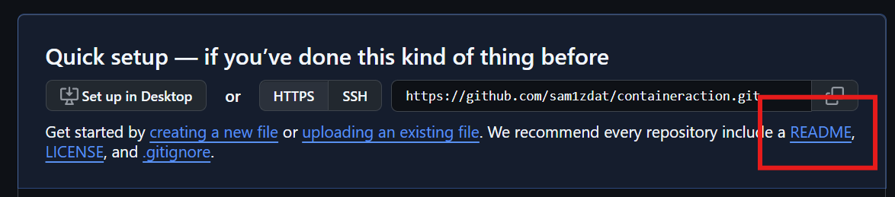

# TP : Créer une Action Container avec GitHub Actions

## Introduction
Afin d'optimiser les performances de notre application, nous devons vérifier la mémoire allouée au conteneur pendant le temps de build. En utilisant GitHub Actions, nous allons envoyer des paramètres d'entrée et de sortie au runner pour insérer un message de salutation et vérifier la mémoire totale depuis les logs de build.

## Architecture du Projet
```
containeraction/
├── entrypoint.sh          # Script principal exécuté dans le conteneur
├── Dockerfile            # Définition de l'image Docker
├── action.yml            # Métadonnées de l'action GitHub
└── .github/workflows/
    └── workflow.yml      # Workflow qui utilise notre action
```

## Préparation du Lab

```bash
# Étapes à effectuer dans l'interface GitHub :
# 1. Navigation vers https://github.com/
# 2. Connexion avec vos identifiants
# 3. Création d'un nouveau dépôt nommé "containeraction"
# 4. Initialisation avec un README optionnel
```

## Étape 1 : Créer le Script Shell pour Afficher les Informations Mémoire

### Fichier : `entrypoint.sh`

```bash
#!/bin/sh
# Script d'entrée pour l'action container
# Ce script sera exécuté à l'intérieur du conteneur Docker

# Affiche un message de salutation personnalisé
# La variable INPUT_MYINPUT est injectée par GitHub Actions
echo "Bonjour $INPUT_MYINPUT"

# Récupère les informations sur la mémoire du système
# /proc/meminfo contient les détails de la mémoire du conteneur
memory=$(cat /proc/meminfo)

# Définit une variable de sortie pour GitHub Actions
# Format ancien (encore supporté) : ::set-output name=nom::valeur
# Cette variable pourra être réutilisée dans les steps suivants du workflow
echo "::set-output name=memory::$memory"

# Alternative moderne (GitHub Actions v2) :
# echo "memory=$memory" >> $GITHUB_OUTPUT
```

**Explications :**
- `#!/bin/sh` : Spécifie l'interpréteur de commandes
- `$INPUT_MYINPUT` : Variable d'environnement injectée par GitHub Actions
- `/proc/meminfo` : Fichier virtuel Linux contenant les informations mémoire
- `::set-output` : Commande spéciale pour communiquer avec GitHub Actions

## Étape 2 : Créer le Conteneur pour Exécuter l'Action

### Fichier : `Dockerfile`

```dockerfile
# Utilise une image Debian légère comme base
# Tag : version 9.5 slim (minimaliste)
FROM debian:9.5-slim

# Copie le script shell dans l'image Docker
# Le script est placé à la racine du système de fichiers du conteneur
ADD entrypoint.sh /entrypoint.sh

# Rend le script exécutable
# chmod +x ajoute les permissions d'exécution
RUN chmod +x /entrypoint.sh

# Définit le point d'entrée du conteneur
# Le script sera exécuté automatiquement au lancement du conteneur
ENTRYPOINT ["/entrypoint.sh"]
```

**Explications :**
- `FROM` : Définit l'image de base
- `ADD` : Copie le fichier local dans l'image
- `RUN chmod +x` : Rend le script exécutable
- `ENTRYPOINT` : Commande exécutée au démarrage du conteneur

## Étape 3 : Créer l'Action GitHub Container

### Fichier : `action.yml`

```yaml
# Métadonnées de l'action GitHub
name: 'ma première action container'
description: 'Action personnalisée pour vérifier la mémoire'
author: 'Super Ahmed'

# Section des inputs (paramètres d'entrée)
inputs:
  myInput:
    description: 'Message de salutation à afficher dans les logs'
    required: true    # Le paramètre est obligatoire
    default: 'Super Ahmed'  # Valeur par défaut si non spécifiée

# Section des outputs (variables de sortie)
outputs:
  memory:
    description: 'Informations complètes sur la mémoire du conteneur'

# Configuration de l'exécution Docker
runs:
  using: 'docker'        # Type d'action : container Docker
  image: 'Dockerfile'    # Chemin vers le Dockerfile à builder
```

**Explications :**
- `inputs` : Paramètres que l'utilisateur peut passer à l'action
- `outputs` : Variables que l'action peut retourner au workflow
- `runs.using: 'docker'` : Exécution dans un conteneur Docker
- `runs.image` : Référence au Dockerfile à construire

## Étape 4 : Ajouter le Workflow GitHub

### Fichier : `.github/workflows/workflow.yml`

```yaml
# Déclencheurs du workflow
# Le workflow s'exécute à chaque push sur n'importe quelle branche
on: [push]

# Définition des jobs
jobs:
  mon-job:
    # Environnement d'exécution : dernière version d'Ubuntu
    runs-on: ubuntu-latest
    
    # Liste des étapes du job
    steps:
    # Étape 1 : Récupération du code source
    - uses: actions/checkout@v2
      # Cette action checkout le code du dépôt
    
    # Étape 2 : Exécution de notre action container personnalisée
    - name: exécuter l'action container personnalisée
      id: bonjour
      # 'uses: ./' référence l'action dans le répertoire racine
      uses: ./
      with:
        # Passage du paramètre d'entrée à notre action
        myInput: 'AG2R LA MONDIALE'
    
    # Étape 3 : Affichage des résultats
    - name: afficher les informations mémoire
      run: |
        # Affiche la variable de sortie 'memory' de l'action précédente
        echo "${{ steps.bonjour.outputs.memory }}"
        
        # Message de confirmation
        echo "=== MÉMOIRE TOTALE AFFICHÉE AVEC SUCCÈS ==="
        echo "L'action container a fonctionné correctement !"
```

**Explications :**
- `on: [push]` : Déclencheur sur événement push
- `runs-on: ubuntu-latest` : Environnement d'exécution
- `actions/checkout@v2` : Action officielle pour récupérer le code
- `uses: ./` : Référence à l'action locale dans le dépôt
- `steps.bonjour.outputs.memory` : Accès aux outputs de l'action

## Étape 5 : Vérification et Résultats Attendus

### Processus d'exécution :
1. **Commit** → Déclenche le workflow
2. **Checkout** → Récupération du code
3. **Build Docker** → Construction de l'image depuis le Dockerfile
4. **Exécution Container** → Lancement du conteneur avec entrypoint.sh
5. **Sorties** → Récupération des résultats

### Résultats attendus dans les logs GitHub Actions :

```
##[group]Run exécuter l'action container personnalisée
Bonjour Étudiant GitHub Actions
##[endgroup]

##[group]Run afficher les informations mémoire
MemTotal:        7843456 kB
MemFree:         1234567 kB
MemAvailable:    2345678 kB
...
=== MÉMOIRE TOTALE AFFICHÉE AVEC SUCCÈS ===
L'action container a fonctionné correctement !
##[endgroup]
```

## Concepts Clés Expliqués

### 1. **Actions Container vs Actions JavaScript**
- **Container Actions** : S'exécutent dans un environnement Docker isolé
- **JavaScript Actions** : S'exécutent directement sur le runner

### 2. **Communication Input/Output**
- **Inputs** : Passés via `with:` dans le workflow
- **Outputs** : Retournés via `set-output` ou `GITHUB_OUTPUT`

### 3. **Cycle de Vie d'une Action Container**
1. Build de l'image Docker
2. Lancement du conteneur
3. Exécution du script entrypoint
4. Récupération des sorties
5. Nettoyage du conteneur

Ce TP démontre comment créer une action GitHub réutilisable qui peut être partagée across différents workflows et dépôts !